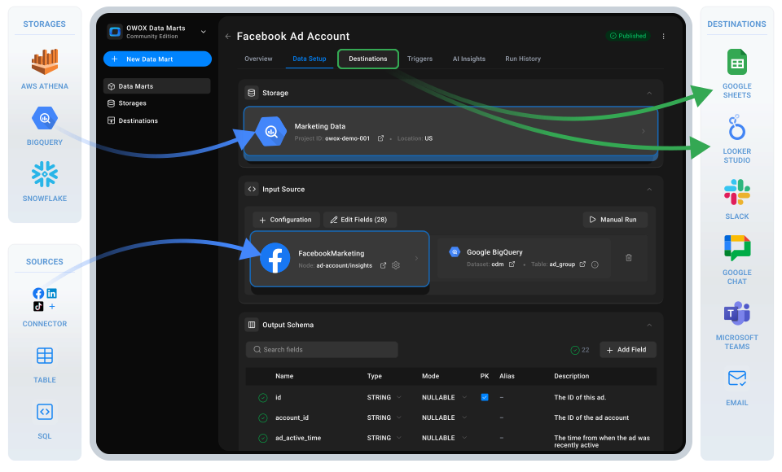

# OWOX Data Marts

## 🏷 Self-Service Analytics Platform

OWOX Data Marts is your way to create a data mart library and empower business users with spreadsheet reports and dashboards — in minutes.

[📘 Quick Start Guide](./docs/getting-started/quick-start.md) | [📚 Documentation](https://docs.owox.com?utm_source=github&utm_medium=referral&utm_campaign=readme) | [🌐 Website](https://www.owox.com?utm_source=github&utm_medium=referral&utm_campaign=readme) | [💬 Slack Community](https://join.slack.com/t/owox-data-marts/shared_invite/zt-3fffrsau9-UlobJVlXzRLpXmvs0ffvoQ) | [🆘 Create an Issue](https://github.com/OWOX/owox-data-marts/issues)



## ✨ Why We Built This

Data analysts’ work means nothing unless business users can play with the data freely.

However, most **self-service analytics** initiatives fail because they compromise either the data analysts’ control or the business users’ freedom.

At OWOX, we value both:

- Data analysts **orchestrate data marts** defined either by [SQL](./docs/getting-started/setup-guide/sql-data-mart.md) or by [connectors](./docs/getting-started/setup-guide/connector-data-mart.md) to sources like Facebook Ads, TikTok Ads, and LinkedIn Ads.
- Business users **enjoy trusted reports** right [where they want them](./docs/destinations/manage-destinations.md) — in spreadsheets or dashboards.

At OWOX, we believe data analysts shouldn’t have to waste time on CSV files and one-off dashboards. Business users shouldn’t have to be forced to use complex BI tools either.

---

<https://github.com/user-attachments/assets/d2d9d913-a6fc-4949-a8e8-d697abd1631a>

---

## 🚀 What You Can Do with OWOX Data Marts

### 📘 Create a Data Mart Library

Bring together data from your warehouse (BigQuery, Snowflake, etc.), APIs, or spreadsheets – and turn it into fast, reusable artifacts that you can manage & share:

- Connectors to any marketing, financial, or CRM data that you can collect into **AWS Athena** or **Google BigQuery** (more supported DWHs are being developed as you read this)
- Custom SQL
- Tables & views
- Table patterns (eg, events_2025\*)

### 📤 Deliver Trusted Data Anywhere

Connect your Data Marts to Google Sheets, Looker Studio, or Excel – empowering business teams with reports they need to make decisions.

### 🧾 Define a Semantic Layer

Document KPIs and metrics once, and keep every dashboard, pivot table, and report in sync with the same numbers & logic behind calculations – no matter the tool.

### 📅 Automate Everything

Use the advanced scheduler to refresh both Data Marts and exports at any time, fully automated and managed from a single place

## 🛠 Installation Guide

**OWOX Data Marts** can be run just about anywhere in minutes.  
Here’s how to get started locally on your machine:

1. **Install Node.js** (version 22.16.0 or higher)

   If it’s not installed yet, [download it here](https://nodejs.org/en/download)

2. **Open your terminal** and run:

   ```bash
   npm install -g owox
   ```

   (You may see warnings - they’re safe to ignore)

3. **Start OWOX Data Marts** locally

   ```bash
   owox serve
   ```

   (You should see something like:
   🚀 Starting OWOX Data Marts...
   📦 Starting server on port 3000...)

4. **Open your browser** and go to **<http://localhost:3000>** to explore! 🎉

For more details on the types of deployment in your infrastructure, check out our [Quick Start Guide](./docs/getting-started/quick-start.md)

## 🔌 Available Connectors

**OWOX Data Marts** includes growing library of **data connectors** that:

- Pull data from **any APIs** like Facebook Marketing, TikTok Ads, LinkedIn Ads, etc.
- Require **zero external tools** or sharing credentials
- Don't require **ANY data engineering resources**
- Free, open-source, and **customizable**
- Give full control over the logic
- Works with [BigQuery](packages/connectors/src/Storages/GoogleBigQuery/README.md) and [AWS Athena](packages/connectors/src/Storages/AwsAthena/README.md)

### Data Sources

| Name                            | Status           | Links                                                                               |
| ------------------------------- | ---------------- | ----------------------------------------------------------------------------------- |
| Bank of Canada                  | 🟢 Public        | [Get started](packages/connectors/src/Sources/BankOfCanada/GETTING_STARTED.md)      |
| Criteo Ads                      | 🟢 Public        | [Get started](packages/connectors/src/Sources/CriteoAds/GETTING_STARTED.md)         |
| Facebook Ads                    | 🟢 Public        | [Get started](packages/connectors/src/Sources/FacebookMarketing/GETTING_STARTED.md) |
| GitHub                          | 🟢 Public        | [Get started](packages/connectors/src/Sources/GitHub/GETTING_STARTED.md)            |
| Google Ads                      | 🟢 Public        | [Get started](packages/connectors/src/Sources/GoogleAds/GETTING_STARTED.md)         |
| LinkedIn Ads                    | 🟢 Public        | [Get started](packages/connectors/src/Sources/LinkedInAds/GETTING_STARTED.md)       |
| LinkedIn Pages                  | 🟢 Public        | [Get started](packages/connectors/src/Sources/LinkedInPages/GETTING_STARTED.md)     |
| Microsoft Ads (former Bing Ads) | 🟢 Public        | [Get started](packages/connectors/src/Sources/MicrosoftAds/GETTING_STARTED.md)      |
| Open Exchange Rates             | 🟢 Public        | [Get started](packages/connectors/src/Sources/OpenExchangeRates/GETTING_STARTED.md) |
| Open Holidays                   | 🟢 Public        | [Get started](packages/connectors/src/Sources/OpenHolidays/GETTING_STARTED.md)      |
| Reddit Ads                      | 🟢 Public        | [Get started](packages/connectors/src/Sources/RedditAds/GETTING_STARTED.md)         |
| TikTok Ads                      | 🟢 Public        | [Get started](packages/connectors/src/Sources/TikTokAds/GETTING_STARTED.md)         |
| X Ads (former Twitter Ads)      | 🟢 Public        | [Get started](packages/connectors/src/Sources/XAds/GETTING_STARTED.md)              |
| Hotline                         | ⚪️ In Discussion | [Discussion](https://github.com/OWOX/owox-data-marts/discussions/55)                |
| Shopify Ads                     | ⚪️ In Discussion | [Discussion](https://github.com/OWOX/owox-data-marts/discussions/63)                |
| Google Business Profile         | ⚪️ In Discussion | [Discussion](https://github.com/OWOX/owox-data-marts/discussions/61)                |

### Data Storages

| Name            | Status    | Links                                                               |
| --------------- | --------- | ------------------------------------------------------------------- |
| Google BigQuery | 🟢 Public | [Readme](packages/connectors/src/Storages/GoogleBigQuery/README.md) |
| AWS Athena      | 🟢 Public | [Readme](packages/connectors/src/Storages/AwsAthena/README.md)      |

If you find an integration missing, you can share your use case and request it in the [discussions](https://github.com/OWOX/owox-data-marts/discussions)

## 🧑‍💻 Contribute

Want to build a connector? We'd love your help.

**To contribute to existing integrations or create a new one:**

- Read the [Contributor Guide](packages/connectors/CONTRIBUTING.md)
- Check [Issues](https://github.com/OWOX/owox-data-marts/issues)
- Join [Discussions](https://github.com/OWOX/owox-data-marts/discussions)
- Join [Slack Community](https://join.slack.com/t/owox-data-marts/shared_invite/zt-3fffrsau9-UlobJVlXzRLpXmvs0ffvoQ)

Whether you're adding a new platform, tweaking an existing connector, or improving docs, we'll support and **spotlight you**.

We're building this **with the community**, not just for it.

## 📌 License

Except for Enterprise-grade features, OWOX Data Marts is free for internal or client use,
not for resale in a competing product. The project uses a dual-license model:

- **Connectors** (`packages/connectors`) are distributed under the [MIT License](licenses/MIT.md)
- **Platform** (all other files and directories) is distributed under the [ELv2 License](licenses/Elasticv2.md)

**Enterprise features** are licensed under the [Enterprise License](licenses/ee.md) and are located
in the `apps/backend/src/data-marts/data-destination-types/ee` directory
or source code files that contain `.ee.` in their file name.
Pricing for Enterprise features is available on [our pricing page](https://www.owox.com/pricing).

---

⭐ **Like this project?** [Star our awesome repo »](https://github.com/OWOX/owox-data-marts)
