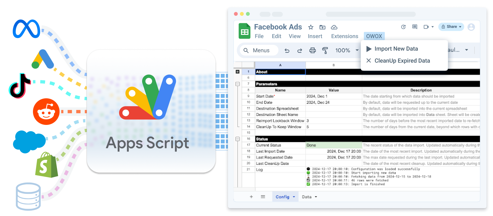

## 🏷️ OWOX Data Marts — Free, Open-Source Connectors for Data Analysts
Collect any marketing, financial, or CRM data into Google Sheets or BigQuery — for free.  
No vendors. No lock-in. No permissions sharing with 3-rd parties. 
Just JavaScript + full control for you.

[🌐 Website](https://www.owox.com?utm_source=github&utm_medium=referral&utm_campaign=readme) | [💬 Join Community](discussions) | [🆘 Create an Issue](issues)

## ✨ Why We Built This
We believe every **data analyst should have the power to automate their data collection & reporting** — without begging for engineering help, paying for expensive SaaS tools, or exposing credentials to vendors.
We want to empower **every business to become data owners** by importing their data into Spreadsheets or data warehouses.

OWOX Data Marts is a growing library of JavaScript-based **connectors** that:
- Pull data from **any APIs** like Facebook, TikTok, LinkedIn, etc.
- Run inside Google Sheets (via Apps Script) or Google Cloud (for BigQuery)
- Require **no external platforms** or credentials sharing
- Doesn't require **ANY data engineering resources**
- Are 100% open-source and **customizable**
- **Free forever**: your connector - your control

Whether you're an analyst at an agency, a startup, or in a huge enterprise, this project gives you **full control over your data collection pipelines**.

## 🔌 Available Connectors

#### Data Sources
| Name | Status | Links
| ------------ | ------ | ----
| Facebook Ads | 🟢 Public | [Google Drive](https://drive.google.com/drive/u/0/folders/1_x556pta5lKtKbTltIrPEDkNqAn78jM4), [Source Code](packages/connectors/src/Integrations/FacebookMarketing), [Readme](packages/connectors/src/Integrations/FacebookMarketing/README.md) 
| Open Exchange Rates | 🟢 Public | [Google Drive](https://drive.google.com/drive/u/0/folders/1akutchS-Txr5PwToMzHrikTXd_GTs-84), [Source Code](packages/connectors/src/Integrations/OpenExchangeRates), [Readme](packages/connectors/src/Integrations/OpenExchangeRates/README.md)
| Bank of Canada | 🟢 Public | [Google Drive](https://drive.google.com/drive/u/0/folders/18c9OHHmdZs-evtU1bWd6pIqdXjnANRmv), [Source Code](packages/connectors/src/Integrations/BankOfCanada), [Readme](packages/connectors/src/Integrations/BankOfCanada/README.md)
| LinkedIn Ads & LinkedIn Pages | 🟢 Public | [Google Drive](https://drive.google.com/drive/folders/1anKRhqJpSWEoeDZvJtrNLgfsGfgSBtIm), [Source Code](tree/main/src/Integrations/LinkedIn), [Readme](packages/connectors/src/Integrations/LinkedIn/README.md)
| TikTok Ads | 🟢 Public | [Google Drive](https://drive.google.com/drive/folders/1zYBdx4Lm496mrCmwSNG3t82weWZRJb0o), [Source Code](packages/connectors/src/Integrations/TikTokAds), [Readme](packages/connectors/src/Integrations/TikTokAds/README.md)
| X Ads (former Twitter Ads) | 🟢 Public | [Google Drive](https://drive.google.com/drive/folders/16PMllaU704wrjHH45MlOBjQWZdxNhxZN), [Source Code](packages/connectors/src/Integrations/XAds), [Readme](packages/connectors/src/Integrations/XAds/README.md)
| Criteo Ads | 🟢 Public | [Source Code](packages/connectors/src/Integrations/CriteoAds), [Readme](packages/connectors/src/Integrations/CriteoAds/README.md)
| Bing Ads | 🟢 Public | [Source Code](packages/connectors/src/Integrations/BingAds), [Readme](packages/connectors/src/Integrations/BingAds/README.md)
| Reddit Ads | 🟡 In Development | [Branch](tree/reddit_connector_v0.1), [Discussion](discussions/2), [Readme](packages/connectors/src/Integrations/RedditAds/README.md) 
| Hotline | ⚪️ In Discussion | [Discussion](discussions/55)
| Shopify Ads | ⚪️ In Discussion | [Discussion](discussions/63)
| Google Business Profile | ⚪️ In Discussion | [Discussion](discussions/61)

### Data Storage Options
| Name | Status | Links
| ------------ | ------ | ----
| Google Sheets | 🟢 Public  | [Issues](issues?q=is%3Aissue%20state%3Aopen%20label%3AGoogleSheets)
| Google BigQuery | 🟢 Public | [Issues](issues?q=state%3Aopen%20%20label%3AGoogleBigQuery)

If you find an integration missing, you can share your use case and request it [here](discussions)

## 🧰 How It Works
- 🎯 Pick your platform (e.g. Facebook Ads) from [existing integrations](packages/connectors/src/Integrations)
- 🧾 Make a copy of the Template from the [table above]
- 🔐 Add your API credentials directly to the sheet — **they stay private**
- 🚀 Run the Apps Script to pull your data
- 📅 Schedule it (optional) for daily/weekly refreshes

If you experience any **issues** or want to report a bug, please open an [issue](issues).

**To become a part of the Core team**, please start by submitting a pull request to the Core part of the product. Understanding TypeScript, Git, and software development is required.

**To get support**, please [visit Q&A](discussions/categories/q-a) first. 

## 🧑‍💻 Contribute or Build Your Own
Want to build a connector? 
We'd love your help.
**To contribute to existing integrations or create a new one**:
- 📘 Read the [Contributor guide](packages/connectors/CONTRIBUTING.md) 
- 📌 Check open [connector requests](issues) 

All you need to get started is basic knowledge of Apps Script and a GitHub login.
No software installation is required on your computer.

Whether you're adding a new API, tweaking one, or improving docs, we'll support and **spotlight you**.

## 🌍 Join the Community
Need help or want to connect with others?
- 💬 [Join our Community](discussions)
- 🗨️ Ask questions or suggest features
We're building this **with the community**, not just for it.

## 📌 License

OWOX Data Marts is free for internal or client use, not for resale in a competing product. The project uses a dual-license model:

- **Connectors** (`packages/connectors`) are distributed under the [MIT License](licenses/MIT.md)
- **Platform** (all other files and directories) is distributed under the [ELv2 License](licenses/Elasticv2.md)

⭐ **Like this project?** [Star the repo here »](https://github.com/OWOX/owox-data-marts)
