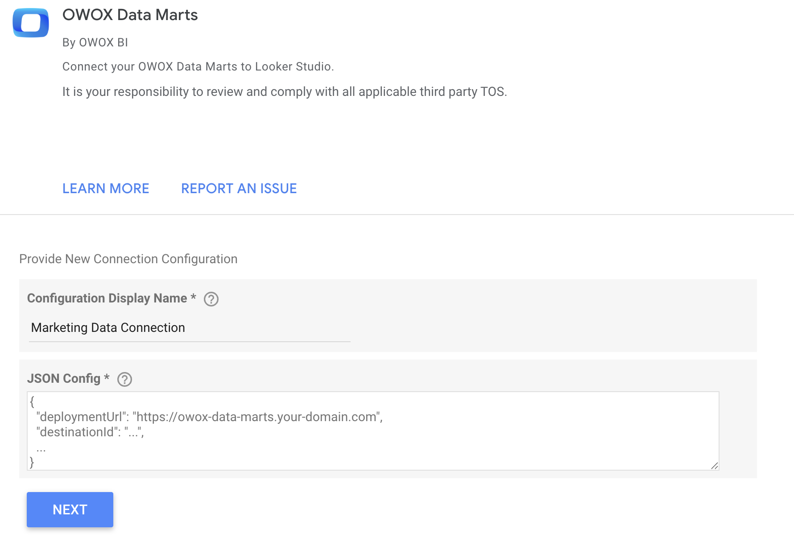
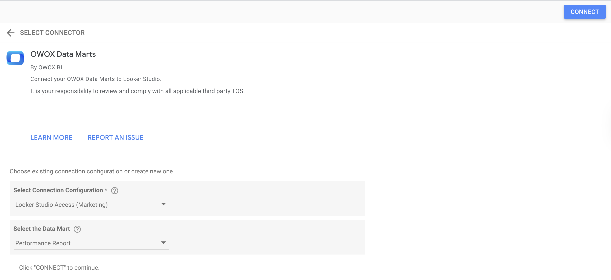

# Data Studio

Data Studio is a powerful data visualization tool that allows users to create interactive dashboards and reports.  
Integration with Data Studio as a **Destination** for OWOX Data Marts enables seamless data access and visualization.

---

<https://github.com/user-attachments/assets/95e499eb-0a36-4180-846b-a829294e1afe>

## Step 1. Create a Destination entity

- In the OWOX Data Marts web application, navigate to **Destinations** from the main navigation pane and click **+ New Destination**.
- Select **Data Studio** from the **Destination Type** dropdown.
- Provide a **Title** — a unique name for this Destination (e.g., "Data Studio Access (Marketing Team)").
- Enter the **Deployment URL** that Data Studio will use to initiate the connection to OWOX Data Marts:
  - Use a secure URL (HTTPS is recommended) to protect data in transit. Example: `https://owox-data-marts.yourdomain.com`.
  - Ensure your OWOX Data Marts server is deployed with a publicly accessible endpoint (e.g., via a domain or load balancer).
    - If you use additional authorization to access your OWOX Data Marts server, make sure URLs with the pattern `/api/external/looker/*` are accessible over the internet and point to your OWOX Data Marts instance.
- Copy the **JSON Config** to your clipboard and click **Save**.
- Click **Save**.

---

## Step 2. Make a Data Mart accessible for Data Studio

- Open the **Data Mart** you want to make accessible in Data Studio and go to the **Destinations** tab.
- In corresponding Data Studio Destination, **enable** toggle with a single click to make the current Data Mart available for Data Studio.
- If needed, click on on the row in Destination section to adjust default **Cache Lifetime** based on how you want to control data freshness when Data Studio requests this data:
  - This setting defines the period during which results from previous query executions are served from the storage-side cache, eliminating the need to re-execute the query.

---

## Step 3. Add a Data Source in Data Studio

- Find the [OWOX Data Marts connector](https://datastudio.google.com/datasources/create?connectorId=AKfycbz6kcYn3qGuG0jVNFjcDnkXvVDiz4hewKdAFjOm-_d4VkKVcBidPjqZO991AvGL3FtM4A) in Data Studio's Gallery.
- **Authorize** with your Google Account (Data Studio requires authorization to connect to data).
- Provide a **Configuration Display Name** — a unique name to help you distinguish different connections (e.g., "Data Studio Access (Marketing)").
- Paste the value from your clipboard into the **JSON Config** field and click **Next**.
- Select the **Connection Configuration** you created previously and click **Next**.
- Select a **Data Mart** and click **Connect**.
- Make sure all the required fields are connected this Data Studio's data source and click **Create Report** or **Explore**.
  - You can control the name and description of fields shown in Data Studio via the **Output Schema** of the Data Mart in your OWOX Data Marts web application.

> **⚠️ Note**: Data from Data Marts is delivered to Data Studio via streaming, so each `getData()` call must stay within Data Studio’s limit of **1,000,000 rows** or 50 MB of data. Refer to the [official documentation](https://developers.google.com/looker-studio/connector/reference#getdata) for more details. If you encounter issues or slow performance, try reducing the number of rows you request to stay under the limit.

Connector in Data Studio (first step):

Connector in Data Studio (second step):

---

For additional guidance or troubleshooting, refer to the [OWOX Community](https://github.com/OWOX/owox-data-marts/discussions)
