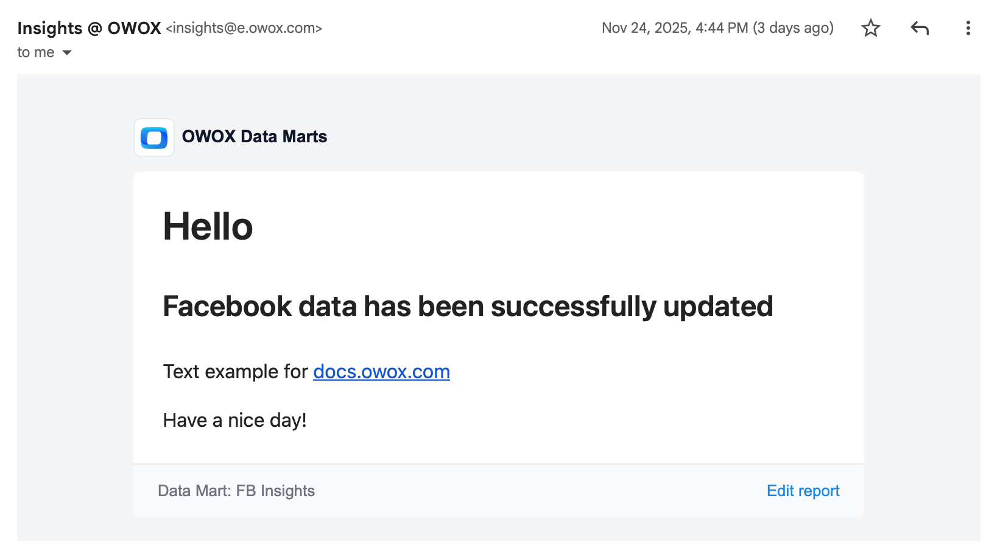

# Email

Configure **Email** as a Destination in OWOX Data Marts to allow business users to receive messages based on the results of each Data Mart run.  

For example, you may want to notify a stakeholder every time a scheduled run produces updated data (such as new results from the Facebook Ads connector). You can also choose to receive an email only when the run result is empty.

> ☝️ Make sure that the `insights@e.owox.com` address is not in your block list, and that emails do not end up in your spam folder.

---

## Configuration Steps

Follow the steps below to configure your **Email** destination.

### Step 1. Create a Destination

#### 1.1. Open the Destinations page

In the OWOX Data Marts web application, open **Destinations** in the main menu and click **+ New Destination**.

#### 1.2. Select the Destination type

Choose **Email** from the **Destination Type** dropdown.

#### 1.3. Configure Destination details

- **Title**: Enter a unique name for the Destination (for example, “Marketing Team”).
- **User emails list**: Add recipient email addresses separated by commas, semicolons, or new lines  
  (for example: `joe.doe@company.com`, `ceo@company.com`, `marketing.team@company.com`).

#### 1.4. Save the Destination

Review the details and click **Save** to create the Destination.

---

### Step 2. Create a Report for this Destination

For each Destination, you can create as many reports as needed and configure different schedules for them.

#### 2.1. Open the Data Mart page

Go to your **Data Mart** and open the **Destinations** tab.

#### 2.2. Add a new report

In the block labeled with the name of your Destination, click **+ Add report**.

#### 2.3. Configure general settings

Enter a report title and make sure the report is assigned to the correct Destination.  
You can also view and copy the list of report recipients.

#### 2.4. Configure the template

Add a **Subject** and write the **Message** using Markdown.  
Switch to **Preview** to check how the email will appear to recipients.

![OWOX Data Marts interface showing a report creation dialog for Marketing Team with a TEMPLATE section containing two fields: Subject field displays The Awesome Data Mart report has been updated, and below is a Message field with Markdown and Preview tabs in the top right corner outlined in red. The message text reads: Dear Marketing Team, We're happy to let you know that the Awesome Data Mart report has been updated. Please feel free to use the updated data for your upcoming analytics. Best regards, The Analytics Team](res/email_message.png)

#### 2.5. Set sending conditions

Decide when the report should be sent based on the Data Mart run result:

- **Send always** – the report is sent after every run.  
- **Send only when result is empty** – the report is sent only if the Data Mart returns no data.  
- **Send only when result is not empty** – the report is sent only if the Data Mart returns data.

OWOX automatically runs the Data Mart before sending the report and checks the result. Your selected condition determines whether the report is sent.

#### 2.6. Save the report

Click **Create New Report** to apply the report settings. If you want to run the report immediately, click **Create & Run report** instead.

#### 2.7. (Optional) Scheduling

To run this report automatically on a schedule (for example, every 5 minutes or every Monday and Wednesday at 3:00 PM), create a new trigger in the **Automate Report Runs** section.  

You can also add the trigger later in the **Triggers** tab of your Data Mart.

![OWOX Data Marts interface showing the Triggers tab selected with a red border at the top navigation. The page displays a Time triggers section with a calendar icon and a red arrow pointing to the Add Trigger button with a plus icon on the right. Below is a table with columns for Trigger Type, Run Target, Schedule, Next Run, and Last Run. One row shows Report Run type linked to Notification for Marketing Team, scheduled Daily at 09:00 America/New_York timezone, with Next Run in 22 hours and Last Run showing Never run. Navigation buttons Previous and Next appear at the bottom](res/email_triggers.png)

---

Have questions? Join the [OWOX Community](https://github.com/OWOX/owox-data-marts/discussions).
