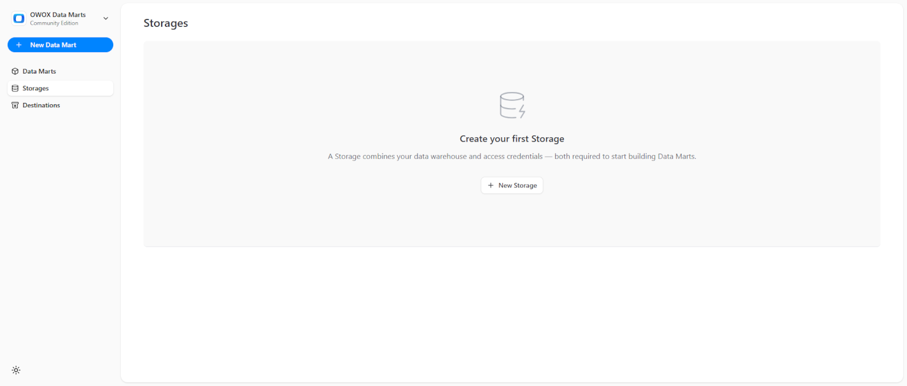

# Managing Storages
Storages are specialized Data Sources that provide an SQL interface for querying and caching data.  
OWOX Data Marts does not retain your data, ensuring that data ownership, storage, and processing control remain with the Data Analyst.  
Each project requires at least one **Storage** to be configured to manage and process your data, though multiple **Storages** may be configured to meet specific data requirements.

## Adding a Storage
To add a **Storage** configuration, click **+ New Storage** button on

---

2. **Access the Storages Settings**  
   Navigate to the OWOX BI dashboard and select **Settings** > **Storages** from the main menu.

2. **Select a Storage Type**  
   Click **Add New Storage**. Choose from supported options:
    * Google BigQuery
    * ClickHouse
    * Amazon Redshift
    * Snowflake  
      A configuration panel will appear for the selected storage type.

3. **Enter Connection Details**  
   Provide the required credentials and settings for the chosen Storage:
    * **Google BigQuery**: Enter your Google Cloud Project ID, select a Google account with BigQuery Data Editor and User roles, and authenticate via OAuth.
    * **ClickHouse**: Provide the host, port, database name, username, and password.
    * **Amazon Redshift**: Input the cluster endpoint, database name, username, and password.
    * **Snowflake**: Specify the account identifier, warehouse, database, schema, username, and password.  
      Ensure your account has appropriate permissions to access the Storage.

4. **Test the Connection**  
   Click **Test Connection** to verify the configuration. If successful, a confirmation message will appear. If the test fails, check your credentials and network settings.

5. **Save the Storage**  
   After a successful test, click **Save**. The Storage will appear in the **Storages** list, ready for use in Data Marts and Reports.

## Connecting to Supported Analytics Database Services
OWOX Data Marts supports analytics database services listed below. Users of **Agency** and **Enterprise** editions will get [official support](../editions.md#terms-of-service).
* [Google BigQuery](supported-storages/Google-BigQuery.md)
* [AWS Athena](supported-storages/AWS-Athena.md)
* Snowflake
* Databricks
* AWS Redshift
* Azure Synapse

## Managing Storages

1. **View and Edit Storages**  
   In **Settings** > **Storages**, view all configured storages. Click a storage name to edit its connection details or update credentials.  
   *Note*: Editing a Storage may affect dependent Data Marts. Review related Data Marts before making changes.

2. **Set Cache Refresh Interval**  
   For each Storage, configure the **Cache Refresh Interval** (from 1 minute to 12 hours) to balance data freshness, report update frequency, and resource usage. Select a predefined value from the dropdown to optimize query performance and reduce resource costs.

3. **Share Storages**  
   Share access to a Storage with team members via the **Share** tab in the storage settings. Enter Google account email addresses to grant Viewer or Editor roles. Shared users can query the storage without accessing underlying credentials.  
   *Note*: Manage permissions carefully to ensure data security.

4. **Remove a Storage**  
   To delete a Storage, select it from the list and click **Remove**. Confirm the action in the popup.  
   *Warning*: Removing a Storage will break any dependent Data Marts or Reports. Ensure no active dependencies exist before deletion.

## Best Practices

* **Choose the Right Cache Interval**: Set the Cache Refresh Interval based on your business needs to avoid unnecessary query runs while keeping data relevant. For example, use shorter intervals (e.g., 1–5 minutes) for real-time analytics and longer intervals (e.g., 1–12 hours) for less frequent reporting.
* **Secure Credentials**: Never share sensitive credentials outside the OWOX BI platform. Use OAuth or encrypted inputs for secure authentication.
* **Monitor Dependencies**: Before editing or removing a Storage, check for dependent Data Marts or Reports to avoid disruptions.
* **Consistent Naming**: Use clear, descriptive names for Storages (e.g., "BigQuery_Sales_2025") to simplify management and collaboration.

## Troubleshooting

* **Connection Errors**: Verify credentials, network access, and firewall settings. For Google BigQuery, ensure your account has BigQuery Data Editor and User roles.
* **Permission Issues**: Confirm that shared users have appropriate roles in the Google Cloud IAM settings or other storage platforms.
* **Query Failures**: Check SQL syntax in dependent Data Marts and ensure the Storage is accessible.

For further assistance, contact our support team at bi@owox.com.