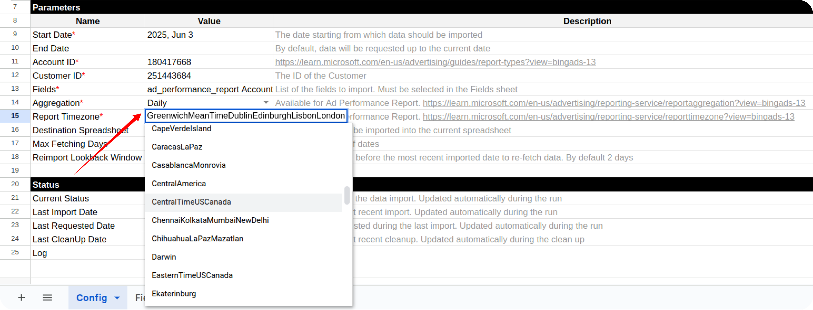
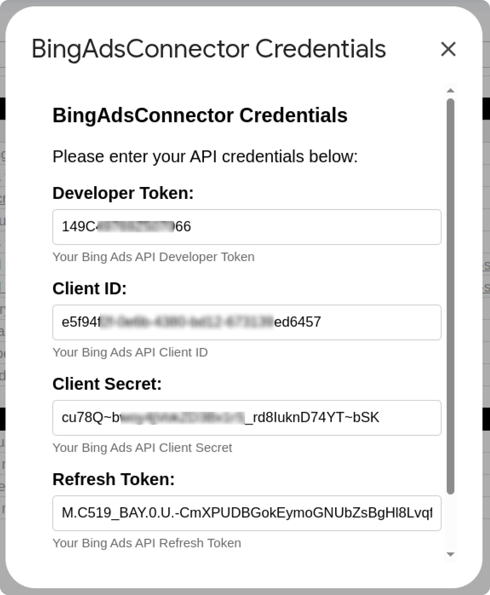
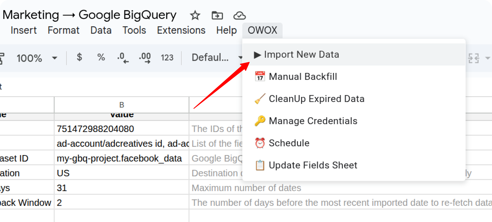

# Microsoft Ads

This guide will walk you through the process of collecting the Microsoft Ads (ex. Bing Ads) data directly into Google Sheets.

## Step 1: Configure the connector

To initiate the data import process from Microsoft Ads, begin by creating a copy of a [**Microsoft Ads → Google Sheets Template**](https://docs.google.com/spreadsheets/d/1OTLrSl1bMDC6IS8eKDYPEOx_LBZZI7kPePh2eTEeiEc/copy)

Once you have copied the template, fill in the required information:

- **Account ID**
- **Customer ID**
- **Aggregation**
- **Report Timezone**

In your newly copied spreadsheet, navigate to the "Config" sheet.

Log in to your Bing Ads account at [https://ads.microsoft.com/](https://ads.microsoft.com/).  
Your **Account ID** and **Customer ID** can be found in the account URL.

Copy and paste both values into the template.

Select the **Report Aggregation** value.  
Refer to the [Microsoft Ads documentation](https://learn.microsoft.com/en-us/advertising/reporting-service/reportaggregation?view=bingads-13) to learn more.  

Choose the **Report Time Zone** to define the timezone for the reporting date range.

## Step 2: Select Fields to Import

Several common data fields are pre-selected by default. To include additional fields in your import, go to the "Fields" tab and check the boxes next to the desired fields.

## Step 3: Fill in Access Credentials

Next, access the custom menu: **OWOX → Manage Credentials**.

Enter your credentials obtained by following this guide: [**How to obtain the credentials for Bing Ads connector**](../../packages/connectors/src/Sources/BingAds/CREDENTIALS.md).

## Step 3: Run connector

Now you have **two options** for importing Microsoft Ads data:

### Option 1: Import Current Day's Data

Choose **OWOX → Import New Data** to load data for the **current day**.

> ℹ️ If you click **Import New Data** again after a successful initial load,  
> the connector will import: **Current day's data**, plus **Additional days**, based on the value in the **Reimport Lookback Window** field.

### Option 2: Manual Backfill for Specific Date Range

Choose **Manual Backfill** to load historical data for a custom time range.

1. Select the **Start Date** and **End Date**  
2. Click the **Run Manual Backfill** button

The process is complete when the **Log** field shows the message:  
**"Import is finished"**  

Finally, your data will appear in new tabs labeled with the corresponding API endpoint types.  

To import more data:

1. Select the additional fields you need in the **Fields** tab.
2. Go to **OWOX → Import New Data** or **OWOX → Run Manual Backfill** again.

## Getting Help

Should you encounter any issues or questions not addressed in this guide:

1. **Check Logs:** Review the "Logs" sheet in your spreadsheet for specific error messages, which can often provide clues to the problem.
2. **Visit Q&A:** Before opening a new issue, please check the existing discussions and answers in our [Q&A section](https://github.com/OWOX/owox-data-marts/discussions/categories/q-a).
3. **Report a Bug:** If you identify a bug, please [open an issue](https://github.com/OWOX/owox-data-marts/issues) on our GitHub repository.
4. **Join the Discussion:** Feel free to join our [discussion forum](https://github.com/OWOX/owox-data-marts/discussions) to ask questions, share insights, or propose improvements to the source.

## License

This connector is part of the OWOX Data Marts project and is distributed under the [MIT license](../../licenses/MIT.md).
