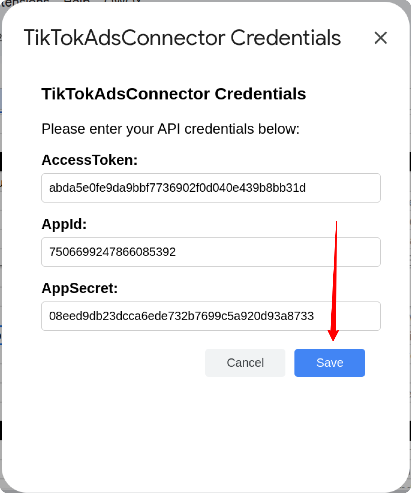
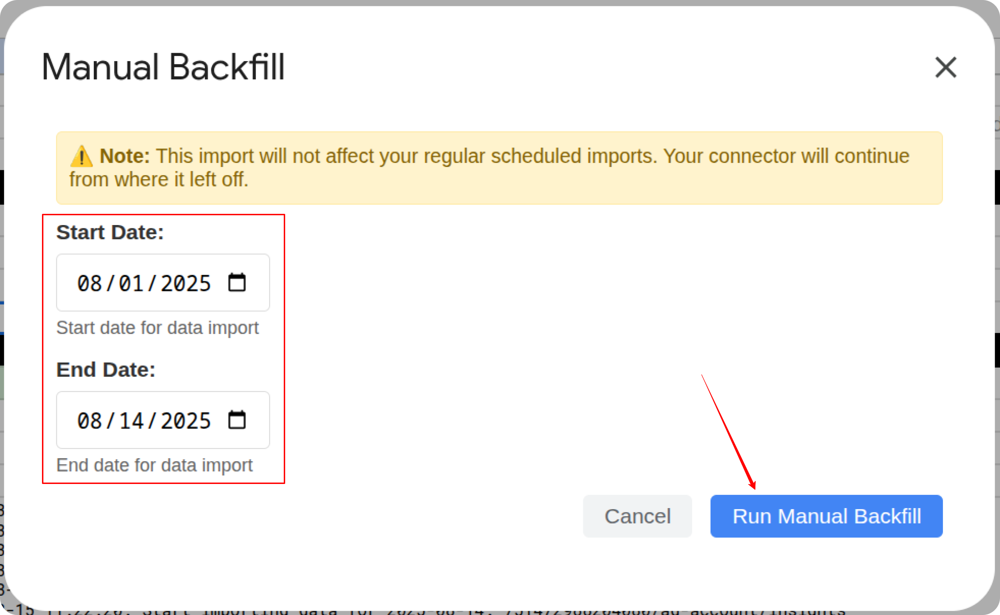

# TikTok Ads

How to Import Data from the TikTok Ads to Google Sheets?

This guide will walk you through the process of collecting the TikTok Ads data directly into Google Sheets.
It provides access to advertiser information, campaigns, ad groups, ads, performance metrics, and custom audiences.

## Available Data Points

The source provides access to the following data types:

1. **Advertiser Information**
   - Account details
   - Basic information about the advertiser
   - Balance and currency information

2. **Campaigns**
   - Campaign structure
   - Budget information
   - Status and targeting
   - Performance optimization settings

3. **Ad Groups**
   - Ad group settings
   - Bidding and budget information
   - Targeting criteria
   - Placement information

4. **Ads**
   - Creative information
   - Status and settings
   - Landing page URLs
   - Call-to-action elements

5. **Performance Metrics**
   - Impressions, clicks, CTR
   - Spend and conversions
   - Video views and engagement metrics
   - Advanced metrics like video completion rates

6. **Custom Audiences**
   - Audience details and size
   - Audience type information
   - Creation and expiration dates
   - Validity status

## Step 1: Configure the connector

To initiate the data import process from TikTok Ads, begin by creating a copy of a [**TikTok Ads → Google Sheets Template**](https://docs.google.com/spreadsheets/d/15AujaJ_x-ibEqs2u3DwvC8qV0hYC7oO1b1LGLEen1mQ/copy)

Once you have copied the template, proceed with the configuration steps:

1. In your newly copied spreadsheet, navigate to the "Config" sheet and add the **Advertiser ID**

You can easily locate your **Advertiser ID** on the left-hand navigation bar within your [TikTok for Business dashboard](https://ads.tiktok.com/).

Copy the Advertiser ID and paste it into the designated field in your spreadsheet:

## Step 2: Select Fields to Import

Several common data fields are pre-selected by default. To include additional fields in your import, go to the "Fields" tab and check the boxes next to the desired fields.

## Step 3: Fill in Access Credentials

Next, access the custom menu: **OWOX → Manage Credentials**.

Enter your TikTok Business API credentials that you obtained by following the instructions in the [**TikTok Ads Source Authentication Guide**](../../packages/connectors/src/Sources/TikTokAds/CREDENTIALS.md).

## Step 3: Run connector

Now you have **two options** for importing TikTok Ads data:

### Option 1: Import Current Day's Data

Choose **OWOX → Import New Data** to load data for the **current day**.

> ℹ️ If you click **Import New Data** again after a successful initial load,  
> the connector will import: **Current day's data**, plus **Additional days**, based on the value in the **Reimport Lookback Window** field.

### Option 2: Manual Backfill for Specific Date Range

Choose **Manual Backfill** to load historical data for a custom time range.

1. Select the **Start Date** and **End Date**  
2. Click the **Run Manual Backfill** button

The process is complete when the **Log** field shows the message:  
**"Import is finished"**  

Finally, your data will appear in new tabs labeled with the corresponding API endpoint types.  

To import more data:

1. Select the additional fields you need in the **Fields** tab.
2. Go to **OWOX → Import New Data** or **OWOX → Run Manual Backfill** again.

## Step 4: Schedule Your Connector

- **Daily Schedule:** To set up an automatic daily import, select "OWOX" > "Schedule" > "Set Daily Schedule"
- **Hourly Schedule:** To configure an automatic hourly import, select "OWOX" > "Schedule" > "Set Hourly Schedule"
- **Remove Schedules:** To disable all existing scheduled runs, select "OWOX" > "Schedule" > "Delete All Schedules"

## Getting Help

Should you encounter any issues or questions not addressed in this guide:

1. **Check Logs:** Review the "Logs" sheet in your spreadsheet for specific error messages, which can often provide clues to the problem.
2. **Visit Q&A:** Before opening a new issue, please check the existing discussions and answers in our [Q&A section](https://github.com/OWOX/owox-data-marts/discussions/categories/q-a).
3. **Report a Bug:** If you identify a bug, please [open an issue](https://github.com/OWOX/owox-data-marts/issues) on our GitHub repository.
4. **Join the Discussion:** Feel free to join our [discussion forum](https://github.com/OWOX/owox-data-marts/discussions) to ask questions, share insights, or propose improvements to the source.

## License

This source is part of the OWOX Data Marts project and is distributed under the [MIT license](../../licenses/MIT.md).
