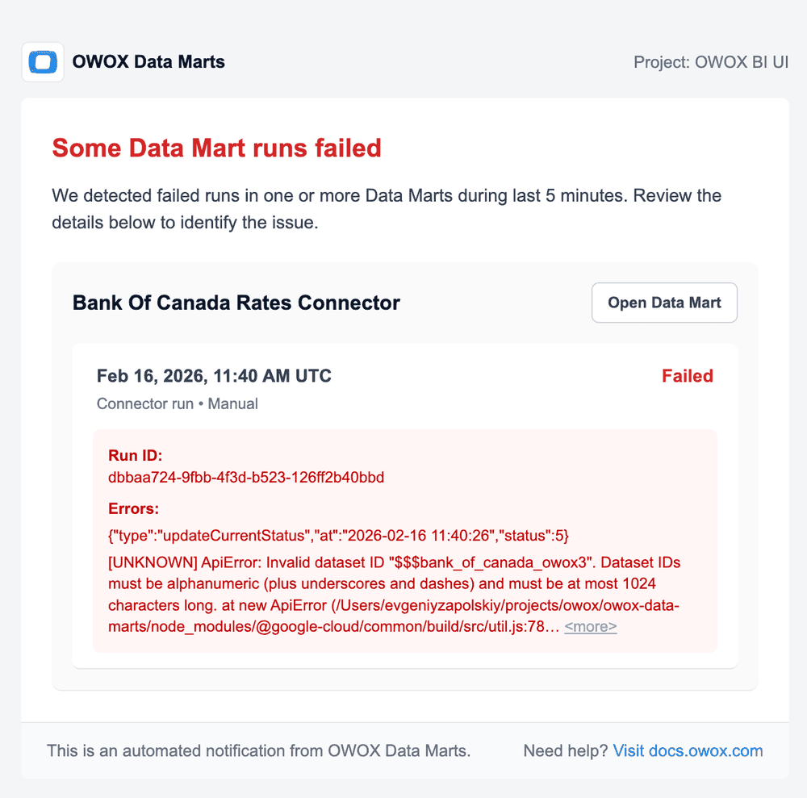
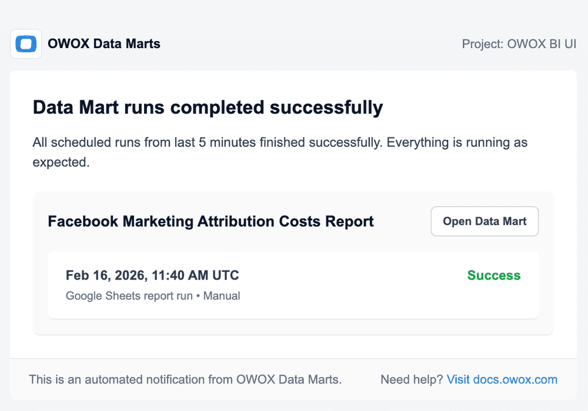

# Email Notifications

Email notifications keep your team informed about Data Mart run results without having to check the dashboard manually. OWOX sends a single batched email covering all relevant runs within the configured [Grouping Delay](./notification-settings.md#grouping-delay) window.

---

## What Triggers an Email

An email is sent when:

- At least one Data Mart run matches the notification type (failed or successful) within the grouping window, **and**
- The notification is enabled, **and**
- At least one receiver is configured.

> ☝️ Make sure that the `service@e.owox.com` address is not in your block list, and that emails do not end up in your spam folder.

---

## Email Content

The email contains a summary of all matching runs grouped by Data Mart.

For **Failed runs** emails, each Data Mart section shows:

- Data Mart name with a direct link
- Run timestamp and duration
- Error message(s) that caused the failure

For **Successful runs** emails, each Data Mart section shows:

- Data Mart name with a direct link
- Run timestamp and duration

---

## Configuring Email Receivers

1. Open **Notifications** in the left sidebar.
2. Click on the notification row you want to configure.
3. In the **Receivers** field, select the project members who should receive the email.
4. Click **Save**.

> ☝️ Only project members with email notifications enabled will receive emails. If a member has notifications disabled in their account settings, they will appear with a warning badge in the receivers list.

---

## 🔗 Related

- [Notification Settings](./notification-settings.md)
- [Webhooks](./webhooks.md)
