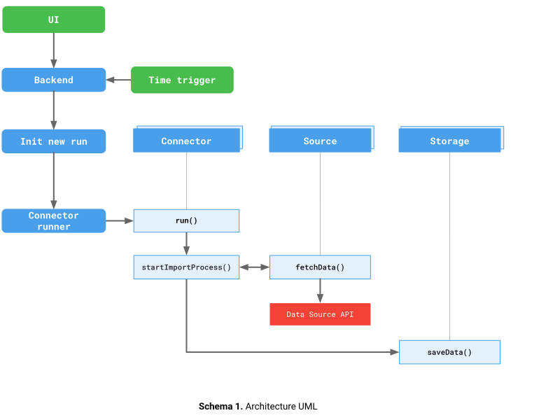

# How to Contribute

There are thousands of different data sources, with their APIs constantly changing, making it impossible to develop integrations for all possible use cases. Therefore, the goal of this guide is to provide clear and understandable steps to adjust existing integrations and develop new ones.

## Architecture Overview

The `@owox/connectors` package is a Node.js library that bundles data source connectors and storage implementations. The package automatically discovers all connectors in the `src/Sources/` directory.

### Key Components

- **Core** (`src/Core/`) — Abstract base classes and utilities shared across all connectors (TypeScript/JavaScript)
- **Sources** (`src/Sources/[SOURCE_NAME]/`) — Data source-specific implementations
- **Storages** (`src/Storages/`) — Storage implementations for persisting data
- **Constants** (`src/Constants/`) — Shared constants and enumerations
- **Configs** (`src/Configs/`) — Configuration utilities

### Build System

The build system automatically:

1. Discovers all connectors in `src/Sources/*/`
2. Bundles each connector with its dependencies into isolated modules
3. Generates a single distributable package with all connectors
4. Creates manifests with metadata for each connector

**No manual registration is required** — just create your connector files in the correct location.

## Creating a New Source

For detailed step-by-step instructions on creating a new source, see [Creating a New Source](./CREATING_CONNECTOR.md).

## Architecture Concepts

### Connector

The `Connector` class orchestrates the data transfer process. It requires three components:

1. **Config** — configuration parameters and validation
2. **Source** — data fetching logic
3. **Storage** — data persistence (optional, can be null)

Key responsibilities:

- Validate configuration parameters
- Calculate date ranges for incremental/backfill imports
- Coordinate between Source and Storage
- Handle status updates and logging
- Implement retry logic for the entire import process

All connectors must extend `AbstractConnector` (in `src/Core/AbstractConnector.js`).

### Source

The `Source` class is responsible for fetching data from the external API. It must implement:

- `fetchData(startDate, endDate)` — fetch data for a date range
- `isValidToRetry(error)` — determine if an error is transient (optional)

Helper methods available:

- `urlFetchWithRetry(url, options)` — HTTP fetch with automatic retry
- `calculateBackoff(attemptNumber)` — exponential backoff calculation
- `getFieldsSchema()` — return available fields for the data source

All sources must extend `AbstractSource` (in `src/Core/AbstractSource.js`).

### Storage

The `Storage` class handles data persistence. It must implement:

- `saveData(data)` — persist data to storage
- `areHeadersNeeded()` — check if headers need to be created
- `addHeader(columns)` — create table/sheet headers

All storages must extend `AbstractStorage` (in `src/Core/AbstractStorage.js`).

### Config

Configuration objects handle:

- Parameter definition and validation
- Status tracking (in_progress, done, error)
- Logging and error handling
- State persistence (LastRequestedDate, LastImportDate)

Configuration classes extend `AbstractConfig` (in `src/Core/AbstractConfig.js`).

## Legal

To clarify the intellectual property license granted with Contributions from any person or entity, we must have on file a signed Contributor License Agreement ("CLA") from each Contributor, indicating agreement with the license terms.

This agreement is for your protection as a Contributor as well as the protection of us and the users of owox-data-marts. It does not change your rights to use your own Contributions for any other purpose.

For more details, please review the full [OWOX CLA](https://cla-assistant.io/OWOX/js-data-connectors).

Pull Request authors must sign [OWOX CLA](https://cla-assistant.io/OWOX/js-data-connectors). It will show up in an automated comment after you create a PR.

If you cannot or do not want to sign this CLA (e.g., your employment contract for your employer may not allow this), **you should not submit a PR**. Instead, please open an issue, and someone else can do the work.

## Questions

Got a questions? Feel free to ask the community [in the Discussion section](https://github.com/OWOX/owox-data-marts/discussions/categories/q-a).
