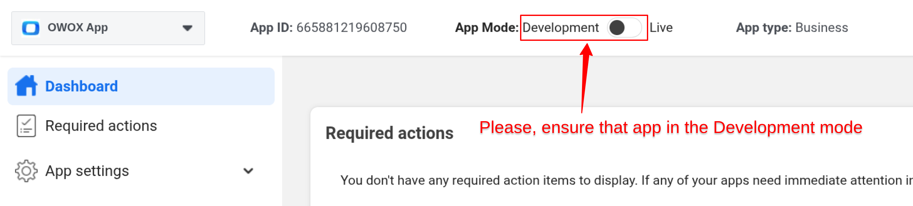
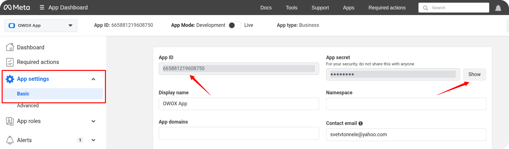
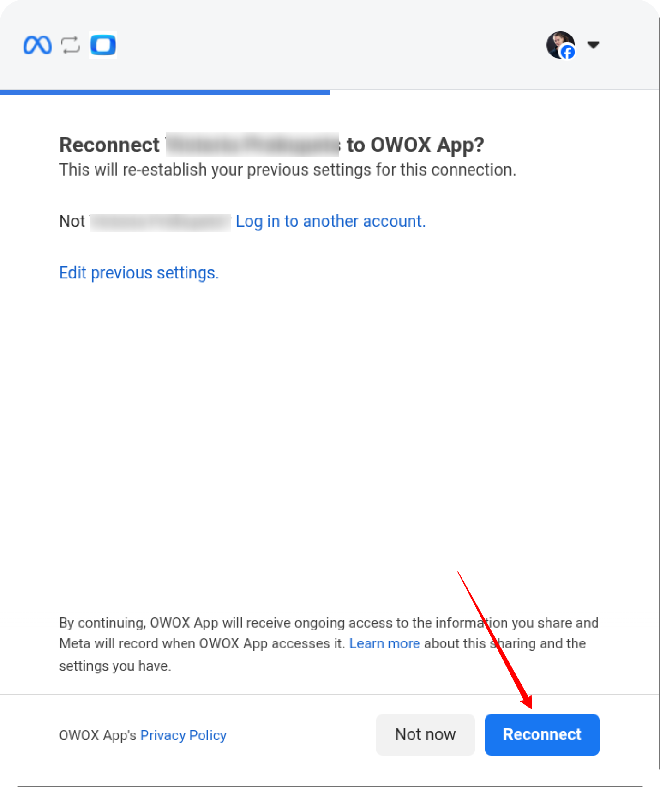
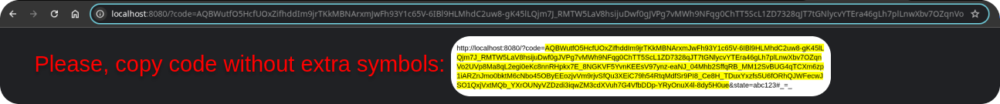
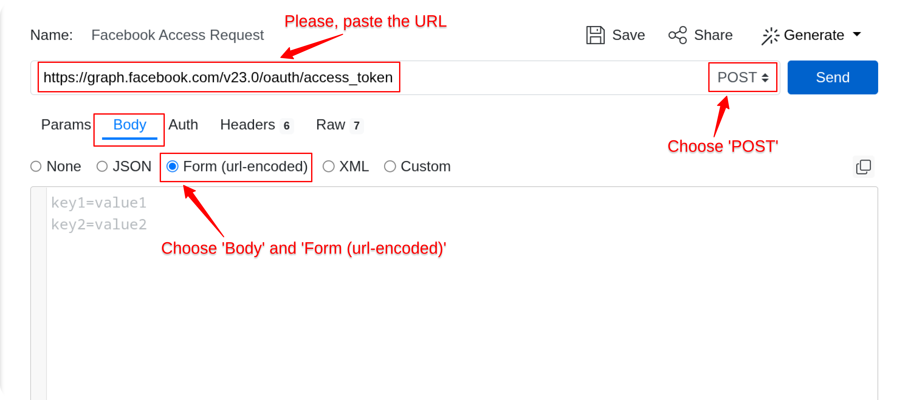
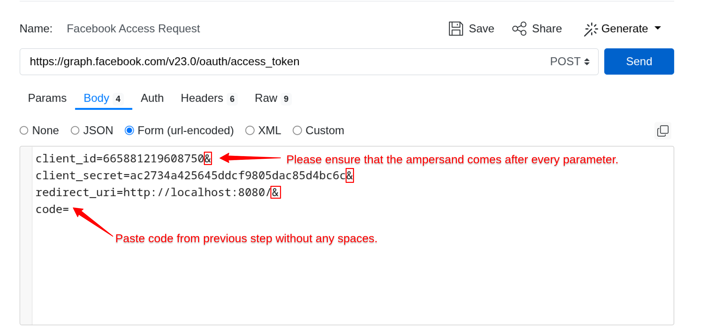
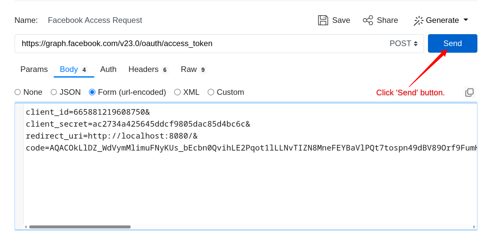
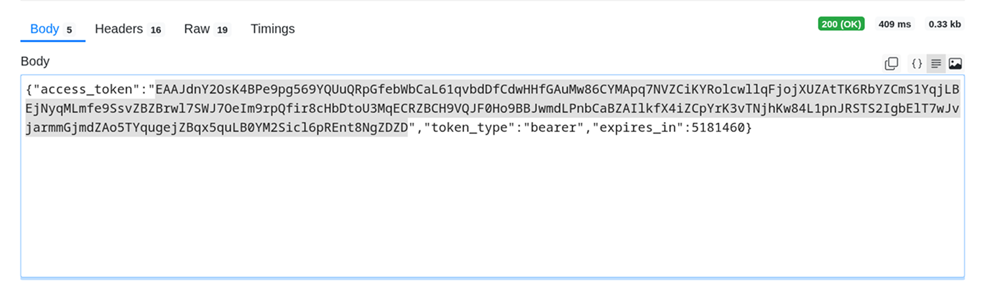
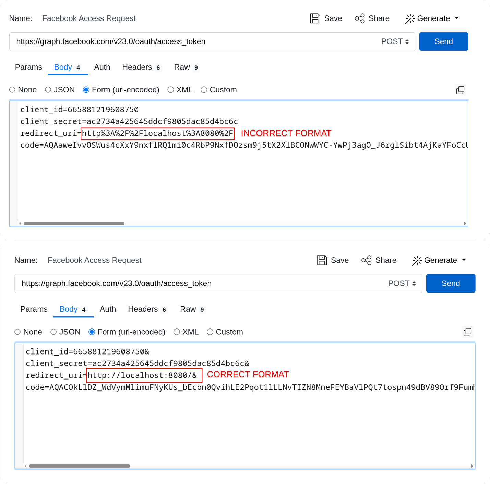

# How to obtain the access token for the Facebook Ads source

To connect to the Facebook Ads API and begin importing data, follow the steps below.

## Step 1: Sign In to the Meta for Developers Portal

Visit the [Meta for Developers](https://developers.facebook.com/) site and log in with your Facebook account.


## Step 2: Create a New App

Navigate to **My Apps** and click the **Create App** button.


Enter the **App Name** in the provided field.


Select **Other** as the use case.  


Select **Business** as the app type and click **Next**.  


Choose the appropriate **Business Portfolio**, then click the **Create App** button.  


## Step 3: Set Up Marketing API

Go to the new app. In your app dashboard, locate **Marketing API** and click **Set Up**.  


## Step 4: Get the temporary token

First, ensure your app is in **Development Mode**:



- Go to **App Settings → Basic**  
- Copy your **App ID**  
- Also note your **App Secret** (you’ll need it in the next step)



Please, build the authorization URL. Use the template below and replace `YOUR_APP_ID` with your actual **App ID**.  

`https://www.facebook.com/v23.0/dialog/oauth?client_id=YOUR_APP_ID&redirect_uri=http://localhost:8080/&scope=ads_read,read_insights&state=abc123`

> **Example**:
> `https://www.facebook.com/v23.0/dialog/oauth?client_id=665881219608750&redirect_uri=http://localhost:8080/&response_type=code&scope=ads_read,read_insights&state=abc123`

- Open the generated URL in your browser  
- Make sure you are logged in with the account that has access to the desired ad account  
- Click **Connect**



After authorization, you’ll be redirected to a URL (note the long `code` parameter).

Copy and save the **code** value (everything after `code=` up to `&state=...`).  
You will need this in the next step.



## Step 5: Generate and Save the Access Token

Now, exchange the authorization code for an **Access Token**. Go to [ReqBin](https://reqbin.com/) or use **Postman**.  
Send a `POST` request to:

``` code
https://graph.facebook.com/v23.0/oauth/access_token
```

with the following parameters in the **Body** tab:

``` code
client_id=YOU_APP_ID&
client_secret=YOUR_APP_SECRET&
redirect_uri=http://localhost:8080/&
code=CODE_FROM_THE_PREVIOUS_STEP
```







Click the **Send** button.

You should receive a response containing your **Access Token**.



Copy and securely save the generated **Access Token**.  
This token will be required to authenticate your API requests.

## Step 6: Use the Access Token

Once you have the access token, you can begin using it as described in the [Getting Started guide](GETTING_STARTED.md).

## Troubleshooting Access Token Errors

If you encounter any errors while obtaining the access token, please refer to the possible causes and solutions below:

### Error: `This authorization code has been used`

**Cause:**  
The authorization code you’re trying to use has already been exchanged for an access token.  
Each authorization code can only be used **once**.

**Solution:**  
Repeat **Step 4** to generate a new temporary authorization code and try again.

### Error: `redirect_uri isn't an absolute URI. Check RFC 3986`

**Cause:**  
The `redirect_uri` parameter in your request is incorrectly formatted or incomplete.  
This field must contain a **valid absolute URI**.

**Solution:**  
Verify that the `redirect_uri` exactly matches the format shown below:  



Example of a correct format:  

``` code
http://localhost:8080/
```

### Error: `This authorization code has expired`

**Cause:**  
The temporary authorization code has expired.  
Facebook (and other platforms) issue short-lived codes that must be exchanged for tokens within a limited time window.

**Solution:**  
Repeat **Step 4** to obtain a new temporary code and retry the request.

---

✅ **Tip:**  
Always generate and use the authorization code **immediately** after receiving it to avoid expiration issues.

## Troubleshooting and Support

If you encounter any other issues:

1. Please [visit Q&A](https://github.com/OWOX/owox-data-marts/discussions/categories/q-a) first
2. If you want to report a bug, please [open an issue](https://github.com/OWOX/owox-data-marts/issues)
3. Join the [discussion forum](https://github.com/OWOX/owox-data-marts/discussions) to ask questions or propose improvements
