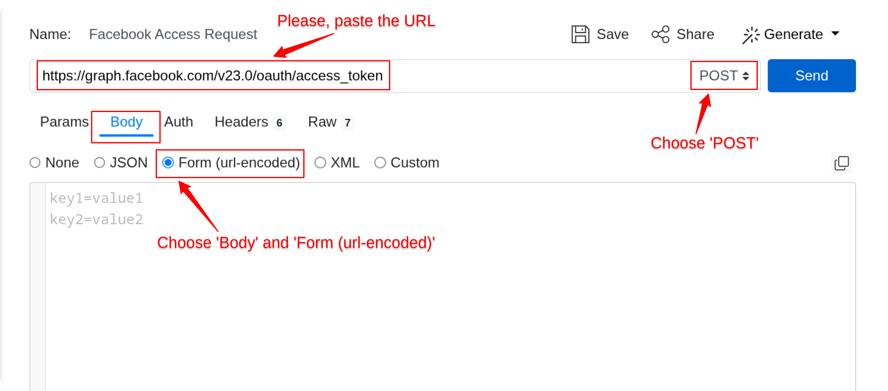
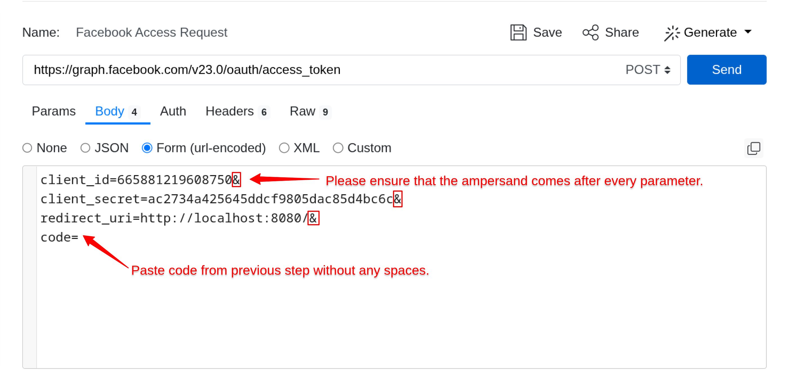
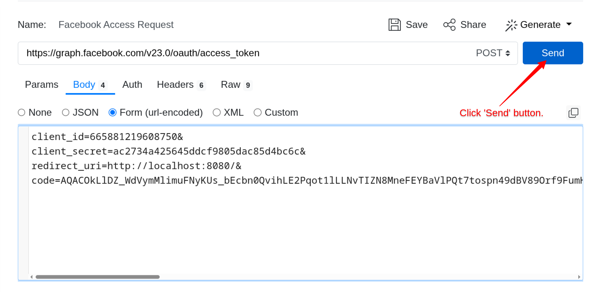
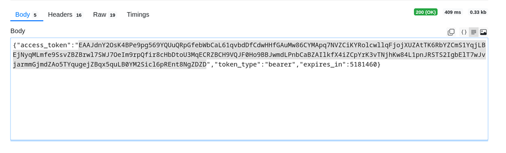
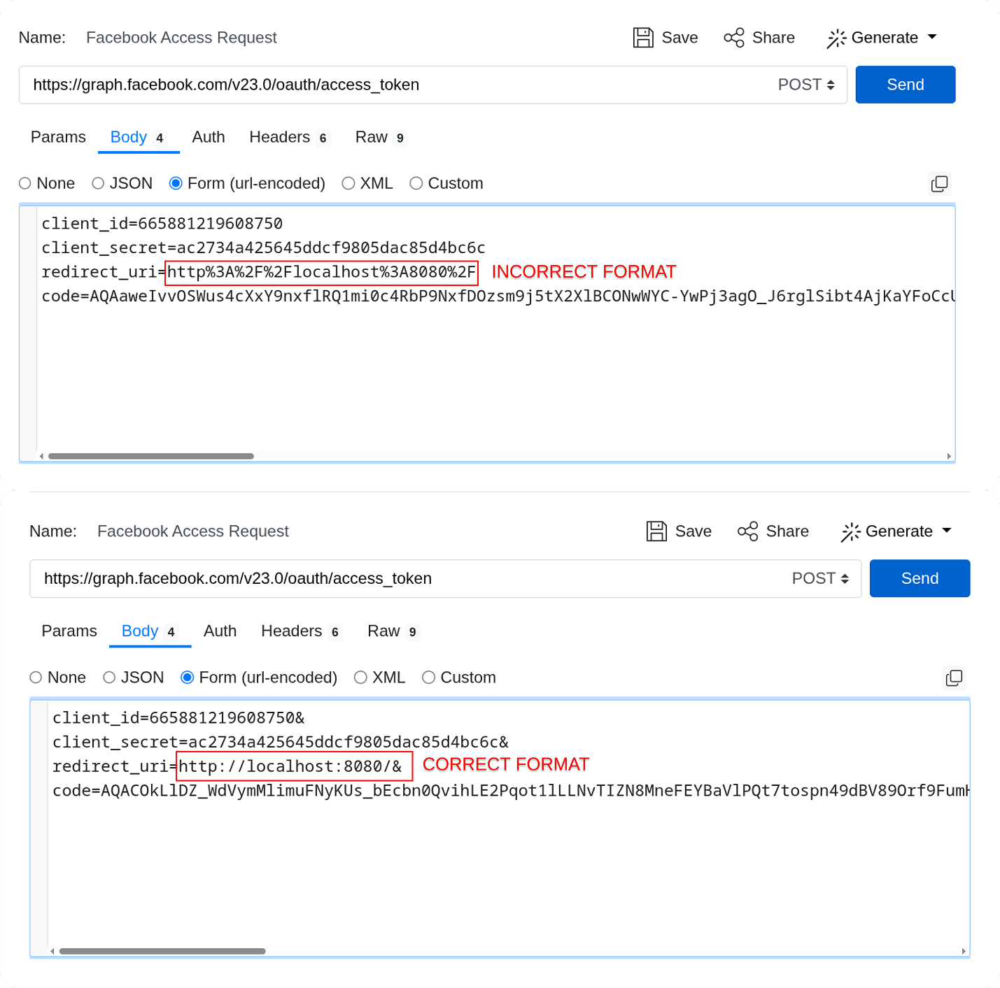

# How to obtain the access token for the Facebook Ads source

To connect to the Facebook Ads API and begin importing data, follow the steps below.

It is two ways to get access to the Facebook Data in Data Mart:

1. OAuth
2. Access Token

## OAuth

Press 'Continue with Facebook' button in the Configure Settings.

Log into Facebook with account that have access to ad data and confirm access. You'll see 'Authenticated as...' on the button if the authentication is succesfull.

Next step: fill Account ID to fetch data from. [Where to find Account IDs?](https://docs.owox.com/packages/connectors/src/sources/facebook-marketing/getting-started/#set-up-the-connector)

(OAUTH IMAGE)

## Access Token

## Step 1: Sign In to the Meta for Developers Portal

Visit the [Meta for Developers](https://developers.facebook.com/) site and log in with your Facebook account. Navigate to **My Apps** and click the **Create App** button. Enter the **App Name** in the provided field. For example, you can use the name 'OWOX Data Marts App'.

(IMAGE)

Select All on the left 'Filter by' panel and **Measure ad performance data with Marketing API** as the use case. Connect your Business Portfolio. Leave all other fields as default and press 'Create app' button on the final step.

(IMAGE)

## Step 4: Get the temporary token

- Go to **App Settings → Basic**  
- Copy your **App ID**  
- Also note your **App Secret** (you’ll need it in the next step)

(IMAGE)

Please, build the authorization URL. Use the template below and replace `YOUR_APP_ID` with your actual **App ID**.  

``` code
https://www.facebook.com/v25.0/dialog/oauth?client_id=YOUR_APP_ID&redirect_uri=http://localhost:8080/&scope=ads_read&state=abc123
```

> **Example**:
> `https://www.facebook.com/v25.0/dialog/oauth?client_id=665881219608750&redirect_uri=http://localhost:8080/&response_type=code&scope=ads_read,read_insights&state=abc123`

- Open the generated URL in your browser  
- Make sure you are logged in with the account that has access to the desired ad account  
- Click **Continue as...** or **Connect**
- Click **Save** and **Got it**

(IMAGE)

After authorization, you’ll be redirected to a URL (note the long `code` parameter).

Copy and save the **code** value (everything after `code=` up to `&state=...`).  
You will need this in the next step.

Note: It is okay that this page is shown 'This site cant be reached' error. We nned only the code from the addreess bar, there is now expected that localhost link will open the actual site.

(IMAGE)

## Step 5: Generate and Save the Access Token

Now, exchange the authorization code for an **Access Token**. Go to [ReqBin](https://reqbin.com/) or use **Postman**.  
Send a `POST` request to:

``` code
https://graph.facebook.com/v25.0/oauth/access_token
```

with the following parameters in the **Body** tab:

``` code
client_id=YOU_APP_ID&
client_secret=YOUR_APP_SECRET&
redirect_uri=http://localhost:8080/&
code=CODE_FROM_THE_PREVIOUS_STEP
```







Click the **Send** button.

You should receive a response containing your **Access Token**.



Copy and securely save the generated **Access Token**.  
This token will be required to authenticate your API requests.

## Step 6: Use the Access Token

Once you have the access token, you can begin using it as described in the [Getting Started guide](GETTING_STARTED.md).

## Troubleshooting Access Token Errors

If you encounter any errors while obtaining the access token, please refer to the possible causes and solutions below:

### Error: `This authorization code has been used`

**Cause:**  
The authorization code you’re trying to use has already been exchanged for an access token.  
Each authorization code can only be used **once**.

**Solution:**  
Repeat **Step 4** to generate a new temporary authorization code and try again.

### Error: `redirect_uri isn't an absolute URI. Check RFC 3986`

**Cause:**  
The `redirect_uri` parameter in your request is incorrectly formatted or incomplete.  
This field must contain a **valid absolute URI**.

**Solution:**  
Verify that the `redirect_uri` exactly matches the format shown below:  



Example of a correct format:  

``` code
http://localhost:8080/
```

### Error: `This authorization code has expired`

**Cause:**  
The temporary authorization code has expired.  
Facebook (and other platforms) issue short-lived codes that must be exchanged for tokens within a limited time window.

**Solution:**  
Repeat **Step 4** to obtain a new temporary code and retry the request.

---

✅ **Tip:**  
Always generate and use the authorization code **immediately** after receiving it to avoid expiration issues.

## Troubleshooting and Support

If you encounter any other issues:

1. Please [visit Q&A](https://github.com/OWOX/owox-data-marts/discussions/categories/q-a) first
2. If you want to report a bug, please [open an issue](https://github.com/OWOX/owox-data-marts/issues)
3. Join the [discussion forum](https://github.com/OWOX/owox-data-marts/discussions) to ask questions or propose improvements
