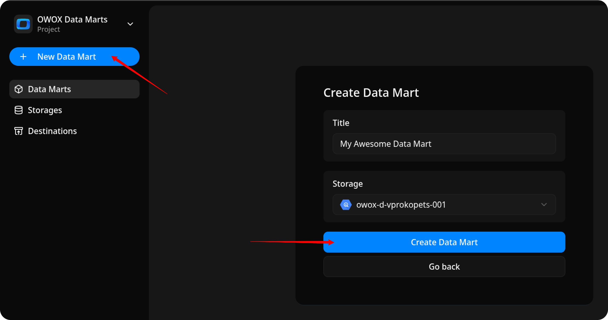
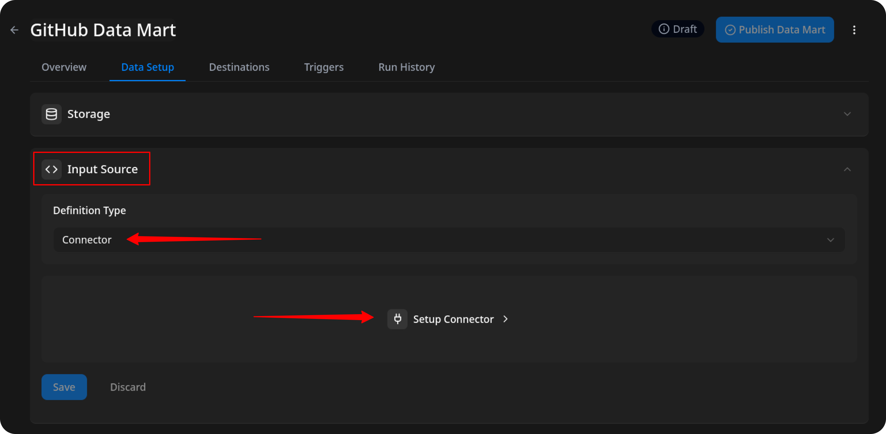
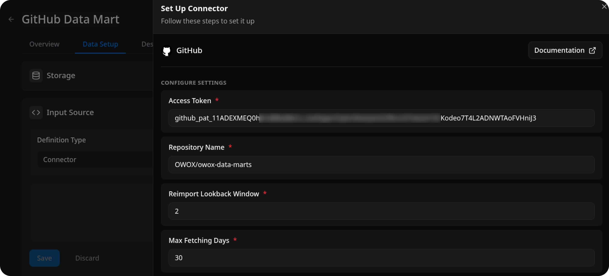
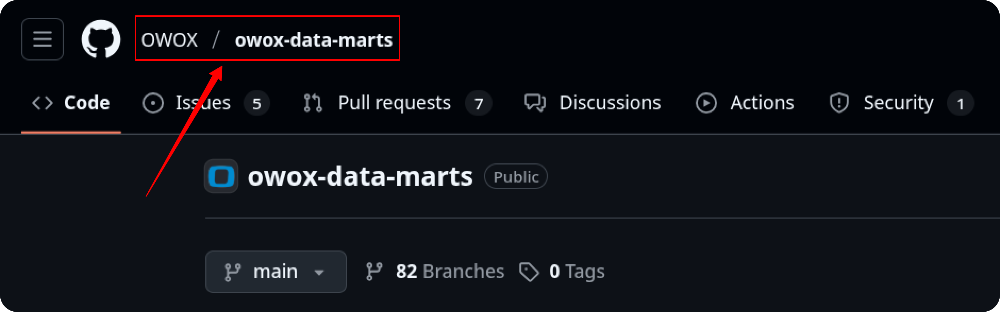
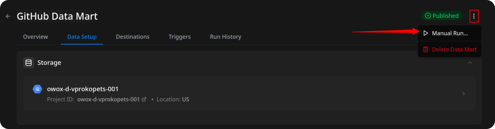
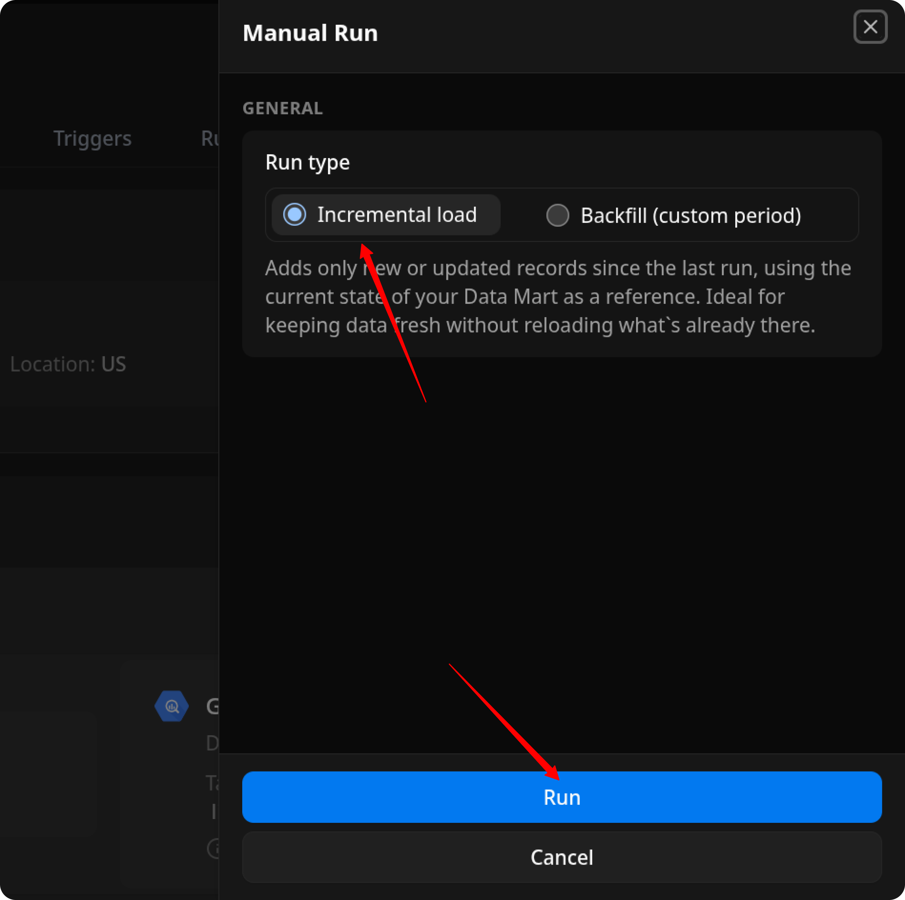

# How to Import Data from the GitHub Source

Before proceeding, please make sure that you have [set up **OWOX Data Marts**](https://docs.owox.com/docs/getting-started/quick-start/) and created at least one storage in the **Storages** section.  

## Create the Data Mart

- Click **New Data Mart**.
- Enter a title and select the Storage.
- Click **Create Data Mart**.

## Set Up the Connector

1. Select **Connector** as the input source type.
2. Click **Set up connector** and choose **GitHub**.  
3. Fill in the required fields:
    - **Access token** – paste the token you generated on [GitHub personal access tokens page](https://github.com/settings/personal-access-tokens).
    - **Repository Name** – you can find it on the main page of your repository on GitHub.
    - Leave the other fields as default and proceed to the next step.

## Configure Data Import

1. Choose one of the available **endpoints**.  
2. Select the required **fields**.  
3. Specify the **dataset** where the data will be stored (or leave the default).  
4. Click **Finish**, then **Save** and **Publish Data Mart**.

## Run the Data Mart

You now have two options for importing data from GitHub source:  

Option 1: Import Current Day's Data

Choose **Manual run → Incremental load** to load data for the **current day**.

> ℹ️ If you click **Incremental load** again after a successful initial load,  
> the connector will import: **Current day's data**, plus **Additional days**, based on the value in the **Reimport Lookback Window** field.

Option 2: Manual Backfill for Specific Date Range

Choose **Backfill (custom period)** to load historical data.  

1. Select the **Start Date** and **End Date**.
2. Click the **Run** button.

The process is complete when the **Run history** tab shows the message:  
**"Success"**  

## Access Your Data

Once the run is complete, the data will be written to the dataset you specified earlier.

If you encounter any issues:

1. Check the Run history for specific error messages
2. Please [visit Q&A](https://github.com/OWOX/owox-data-marts/discussions/categories/q-a) first
3. If you want to report a bug, please [open an issue](https://github.com/OWOX/owox-data-marts/issues)
4. Join the [discussion forum](https://github.com/OWOX/owox-data-marts/discussions) to ask questions or propose improvements
