# How to Obtain the Access Token for the Google Ads Source

To connect to the **Google Ads API** and start importing data with OWOX Data Marts, follow the steps below.

**Prerequisites**:

You must have a **Manager (MCC)** account in Google Ads.  
If you don’t have one yet, follow Google’s instructions to create it:  
[Create a Manager Account](https://support.google.com/google-ads/answer/7459399?hl=en)

## Step 1. Register in the API Center

_(Optional — only required if you do not already have a Developer Token)_  
If you already have a **Developer Token** with Basic Access in your Manager (MCC) account, you may skip this step and go to the [choosing authentication method](#next-step-choose-your-authentication-method).

1. In your **Manager (MCC)** account, open **Admin → API Center**.  
2. Fill out the registration form with the following details:  
   - **API Contact Email**  
   - **Company Name**  
   - **Company URL**  
   - **Company Type**  
   - **Intended Use** — for example:  
     _“For in-house marketing analytics and retrieving ad data for reporting.”_  
   - **Principal Place of Business**  
3. Check the box to accept the Terms and Conditions.  
4. Click **Create Token**.

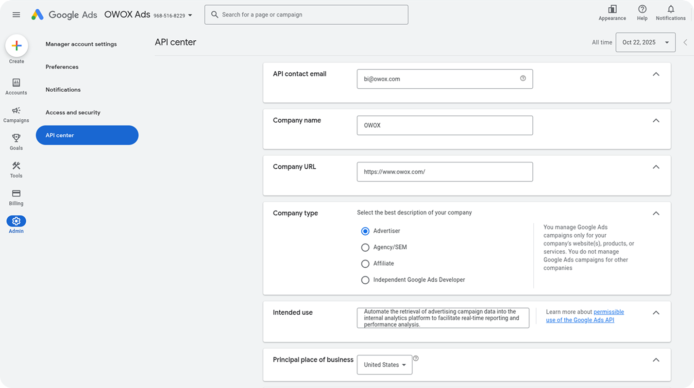

## Step 2. Request Basic Access for the Developer Token

By default, new developer tokens can only access **test accounts**.  
To retrieve data from active Google Ads accounts, you must apply for **Basic Access**.

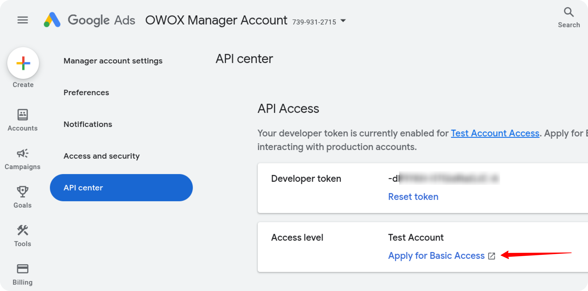

In the Basic Access application form:

1. Fill in your company details.  
2. Describe your company’s business model and how you use Google Ads.  
   Example:  
   _“We leverage Google Ads to execute targeted campaigns that increase customer acquisition and brand awareness.”_  
3. Attach a document or PDF with a sample of your planned report design.  
4. For the question _“Do you plan to use your Google Ads API token with a tool developed by someone else?”_, select **Yes** and include the OWOX Data Marts URL:  
   [https://github.com/OWOX/owox-data-marts](https://github.com/OWOX/owox-data-marts)  
5. For the question _“Do you plan to use your token for App Conversion Tracking and Remarketing API?”_, select **No**.  
6. Under _“Which of the following Google Ads capabilities does your tool provide?”_, check at least **Campaign Management** and **Reporting**.  
7. Submit the application.

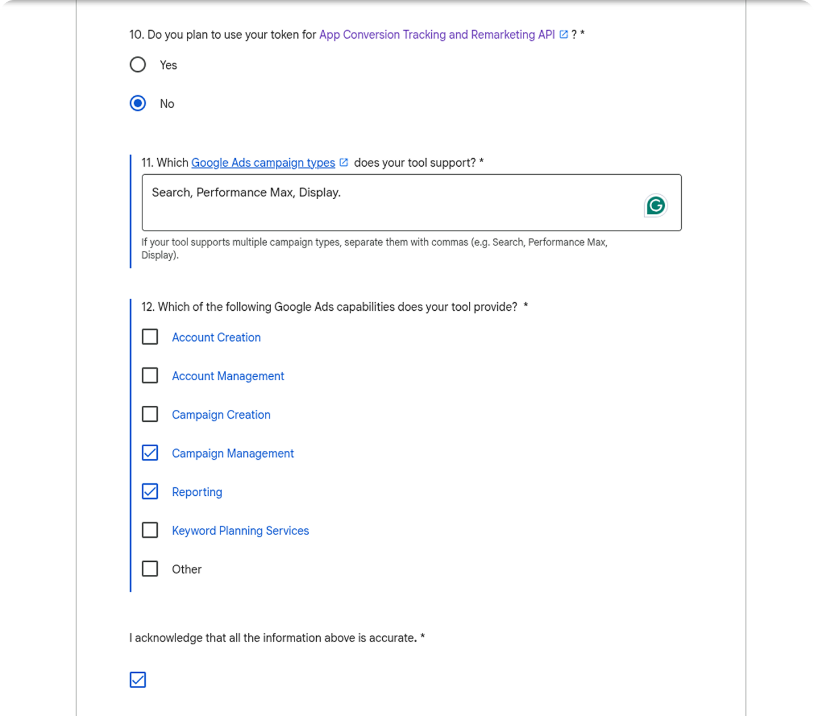

Within approximately **three business days**, the Google Ads team will respond to your registered email address.  
If approved, you’ll see your access level updated in the API Center:  

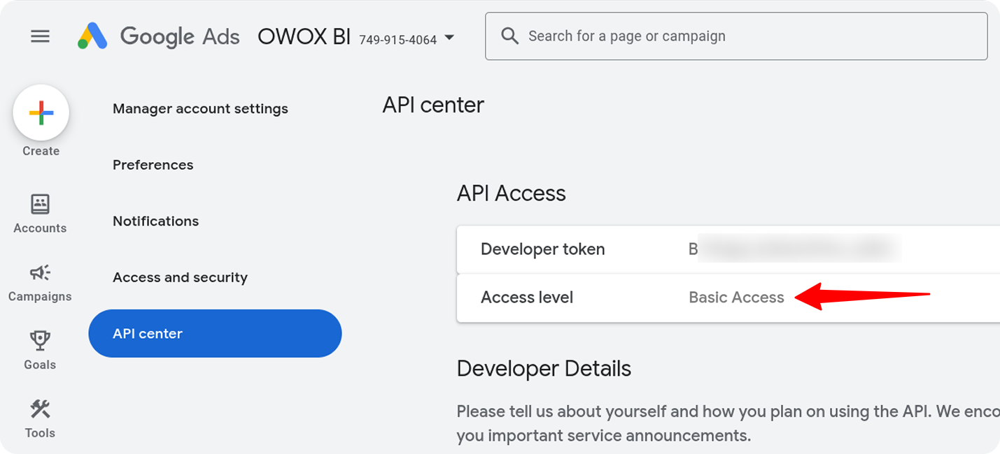

## Next Step: Choose Your Authentication Method

Now that your Developer Token is approved (or if you already have one), you can proceed with authentication.  
OWOX Data Marts supports two ways to connect to the Google Ads API:

- **[OAuth2 Authentication](#option-1-oauth2-authentication)**  
- **[Service Account Authentication](#option-2-service-account-authentication)**

Choose your preferred method below.

## Option 1. OAuth2 Authentication

To use OAuth2 authentication for the Google Ads connector, you will need the following credentials:

- **Customer ID** — the ID of the **Google Ads ad account** you want to retrieve data from (found in the top-right corner of the Google Ads UI).  
- **Login Customer ID** — the ID of your **Google Ads Manager (MCC)** account.  
- **Developer Token** — available in the **API Center** of your **Google Ads Manager (MCC)** account. If you don’t have a Developer Token yet, please see **[Step 1: Register in the API Center](#step-1-register-in-the-api-center)** at the beginning of this tutorial.

In addition, OAuth2 requires the following:  

- **Client ID**  
- **Client Secret**  
- **Refresh Token**

Follow the steps below to generate the OAuth2 credentials.

### Step 1: Create OAuth2 Client Credentials in Google Cloud Console

1. Open **Google Cloud Console** and search for **Google Auth Platform → Clients**.  
2. Click **Create Client**.  
3. Select **Web application** as the application type.  
4. Enter any name (e.g., "OWOX Google Ads OAuth Client").  
5. Fill in the following fields:

   **Authorized JavaScript origins:** `http://localhost:8080`  
   **Authorized redirect URIs:** `https://developers.google.com/oauthplayground`

6. Click **Create**.

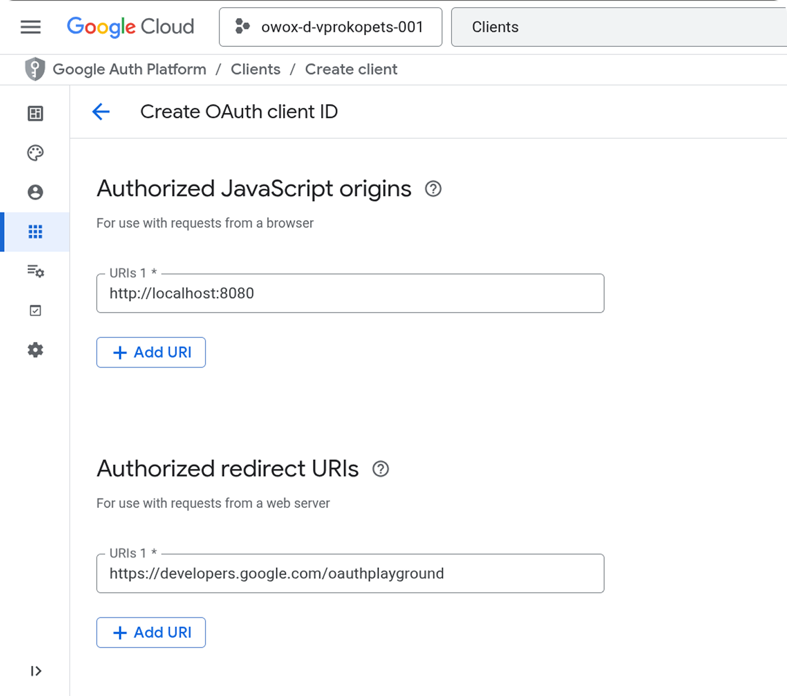

A window will appear containing your **Client ID** and **Client Secret**.  
Copy them and store them securely (for example, in a password manager or encrypted storage), or download the JSON file for future use.

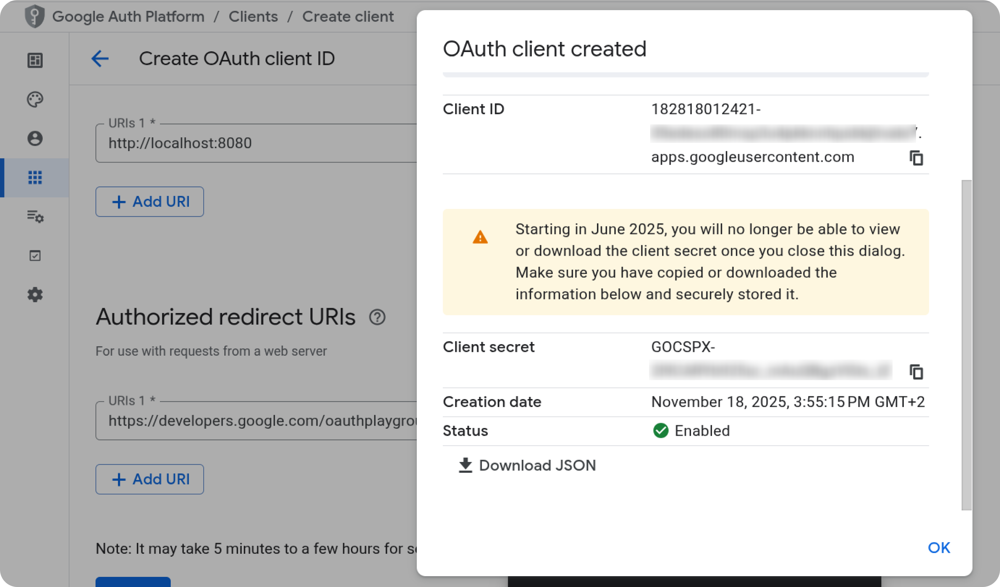

### Step 2: Generate a Refresh Token Using OAuth Playground

Open the OAuth Playground: [https://developers.google.com/oauthplayground/](https://developers.google.com/oauthplayground/)

 _(Optional but recommended)_  
If the Google account you are using **does not** have access to the GCP project where the OAuth Client was created (for example, if the Client ID and Client Secret were provided by your IT team), configure custom credentials as follows:

1. Click the **gear icon** in the top-right corner.  
2. Enable **“Use your own OAuth credentials”**.  
3. Paste your **Client ID** and **Client Secret** into the corresponding fields.  
4. Click **Close**.

On the left panel, scroll and select **Google Ads API**.  
Click **Authorize APIs**.  
When prompted, sign in with your Google account and grant access. After authorization, click **“Exchange authorization code for tokens”**.

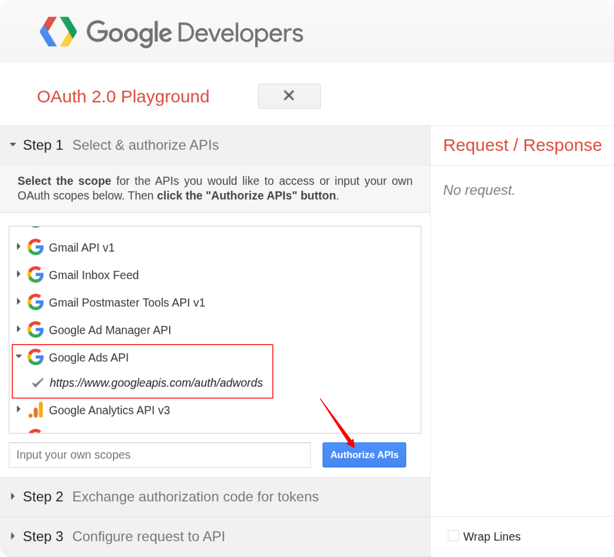

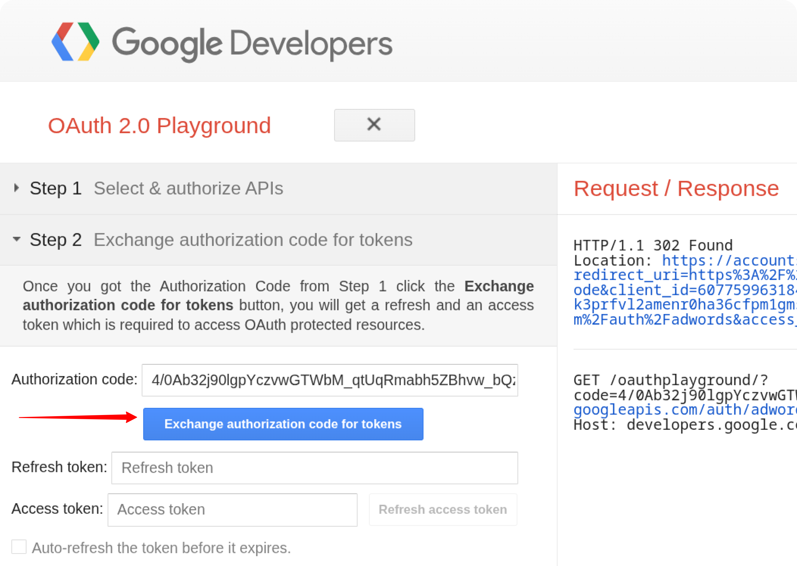

Your **Refresh Token** will appear on the right side of the screen.  

Copy and store it securely — for example, in your company’s password manager or a secure encrypted storage, not in plain text or shared documents — you will need it to authenticate API requests via OAuth2.

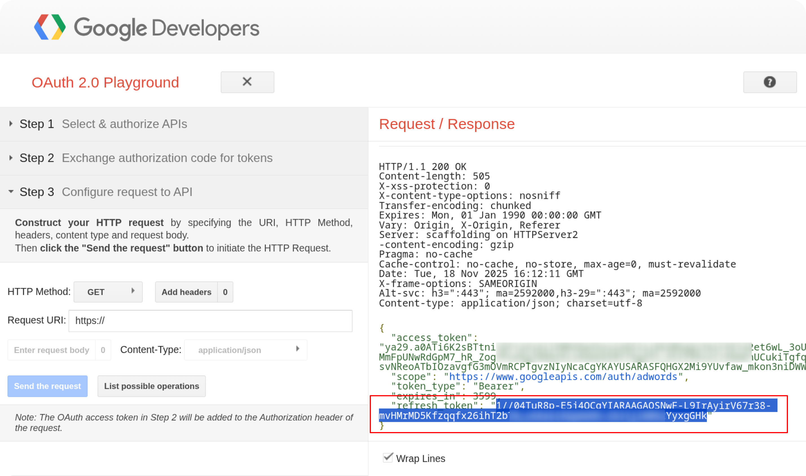

At this point, you should have the following credentials:

| Credential | Where to get it |
|-----------|------------------|
| **Developer Token** | In the **API Center** of your Google Ads **Manager (MCC)** account |
| **Customer ID** | At the top-right corner of the **ad account** you want to retrieve data from |
| **Login Customer ID** | At the top-right corner of your **Manager (MCC)** account |
| **Client ID** | In Google Cloud Console → **Google Auth Platform → Clients**, displayed when creating an OAuth client or in the downloaded JSON |
| **Client Secret** | In Google Cloud Console → **Google Auth Platform → Clients**, displayed when creating an OAuth client or in the downloaded JSON |
| **Refresh Token** | Generated via **OAuth Playground** after authorizing the Google Ads API with your Client ID and Client Secret |

You can continue with the setup described in the [GETTING_STARTED](GETTING_STARTED) guide.
If you prefer to use Service Account authentication instead of OAuth2, follow the steps below.

## Option 2. Service Account Authentication

### Step 1: Save Your Developer Token and Customer ID

- **Developer Token** — copy it from the **API Center** in your **Manager (MCC)** account.
If you don’t have a Developer Token yet, please see **[Step 1: Register in the API Center](#step-1-register-in-the-api-center)** at the beginning of this tutorial.  
- **Customer ID** — copy it from the top-right corner of your **ad account** (the account from which you want to retrieve data).  
- **Login Customer ID** — copy the ID of your **Manager (MCC)** account.  

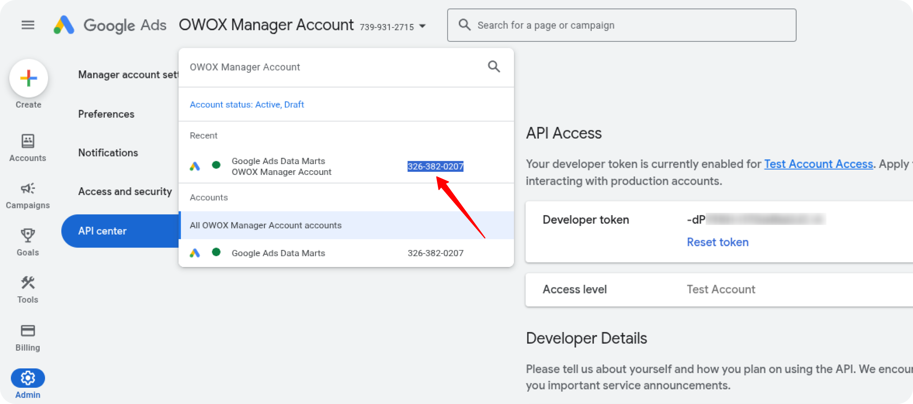

### Step 2: Create a Service Account in Google Cloud Platform (GCP)

1. Open your GCP project and navigate to  
   **IAM & Admin → Service Accounts → Create Service Account**.  
2. Enter a **name** and **description**, then click **Create and Continue**.  
3. Assign the following roles:  
   - **BigQuery User**  
   - **BigQuery Data Editor**  
4. Click **Continue**, then **Done**.  
5. Locate the newly created service account, click the **three dots** (⋮) on the right-hand side, and select **Manage Keys**.  
6. In the **Keys** tab, click **Add Key → Create New Key → JSON**.  
7. The JSON key file will be downloaded automatically — please **store it securely**, as you will need it later.

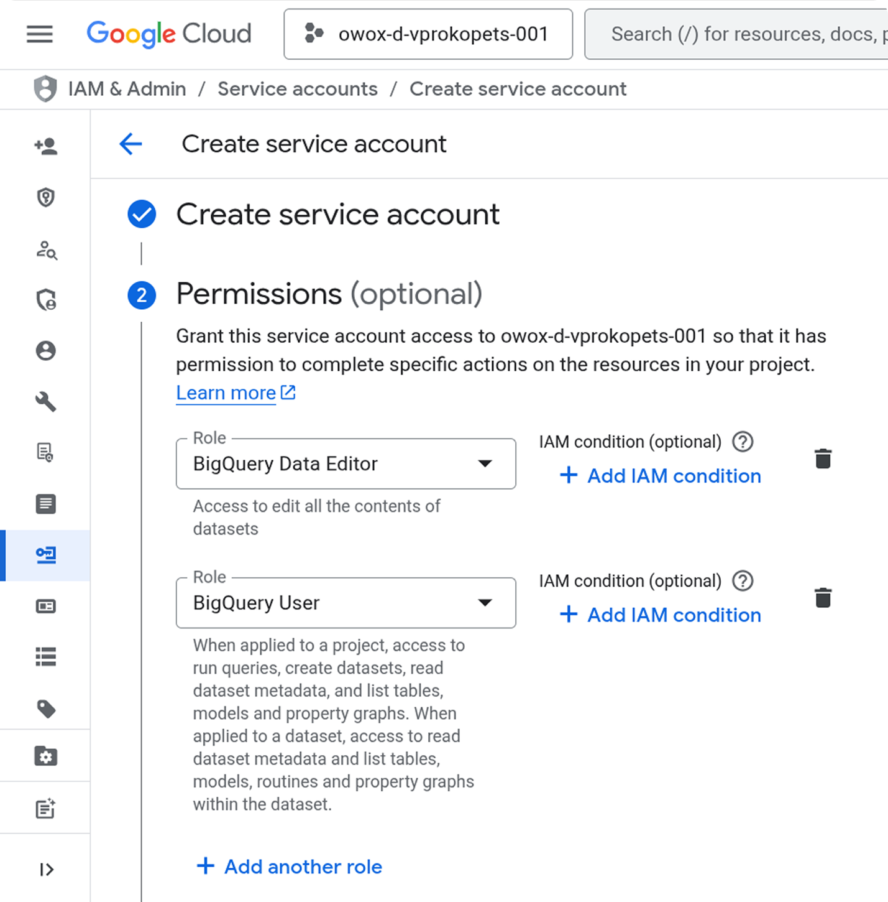

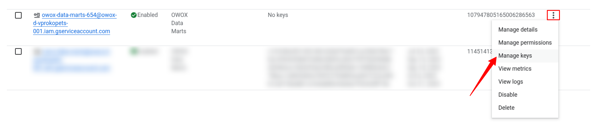

### Step 3: Set Up Access in Google Ads

**Add the Service Account to Google Ads**:

1. Open your **Google Ads account** and go to **Admin → Access and Security**.  
2. Click the **+ (plus)** icon to add a new user.  
3. Paste your **service account email address**.  
4. Assign **Read-only** permissions.  
5. Click **Add Account**.  
6. Repeat the same steps for your **Manager (MCC)** account.

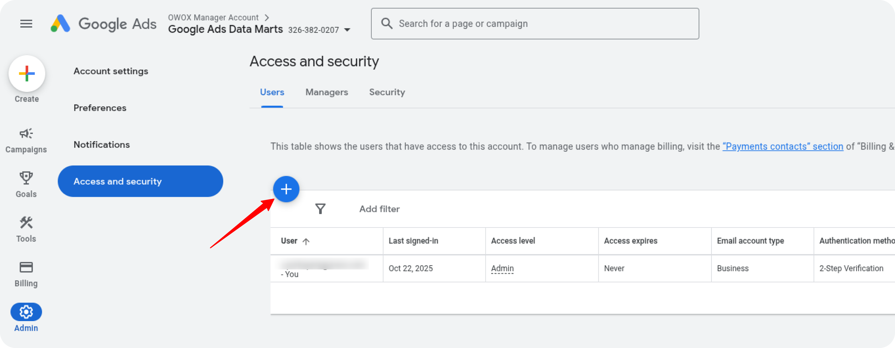

At this point, you should have the following credentials:

| Credential | Where to get it |
|-----------|------------------|
| **Service Account Key (JSON)** | In Google Cloud Console → **IAM & Admin → Service Accounts → Manage Keys → Add Key → JSON** |
| **Developer Token** | In the **API Center** of your Google Ads **Manager (MCC)** account |
| **Customer ID** | At the top-right corner of the **ad account** you want to retrieve data from |
| **Login Customer ID** | At the top-right corner of your **Manager (MCC)** account |

✅ **You’re all set!**  
You can now use your credentials to access and import data from Google Ads via OWOX Data Marts.
