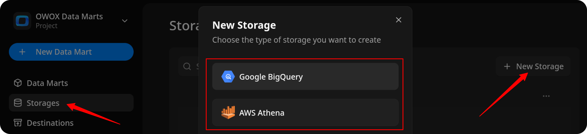
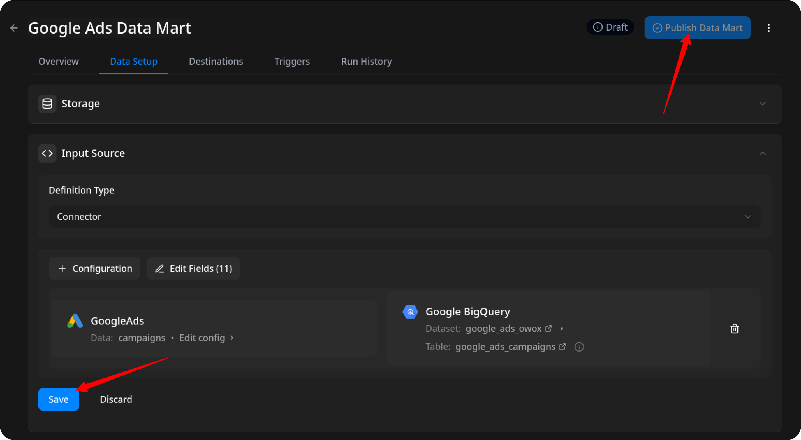
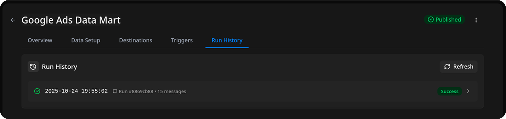

# How to Import Data from the Google Ads Source

Before proceeding, please make sure that:

- You have already created a credentials, as described in [CREDENTIALS](CREDENTIALS.md).  
- You [have run **OWOX Data Marts**](https://docs.owox.com/docs/getting-started/quick-start/) and created at least one storage in the **Storages** section.

## Create the Data Mart

- Click **New Data Mart**.
- Enter a title and select the Storage.
- Click **Create Data Mart**.

## Set Up the Connector

1. Select **Connector** as the input source type.  
2. Choose **Google Ads**.  

3. Enter your **Customer ID** in the format `12345678` (without dashes).  
   > ⚠️ This is the ID of the account from which you want to retrieve data.

4. Fill in the required fields depending on your chosen authentication type.  
(If you need help obtaining any of these values, please refer to the detailed instructions in the [CREDENTIALS](CREDENTIALS.md) guide.)

### For **OAuth2 Authentication** (without service account)

- **Customer ID** – enter the ID of the **ad account** you want to retrieve data from.  
  You can find it in the top-right corner when viewing the specific ad account in Google Ads.  
  *(Format: `12345678` without dashes.)*
- **Login Customer ID** – enter the ID of your **Manager (MCC)** account.  
  You can find it in the top-right corner when you are logged into your MCC account.
   *(Format: `12345678` without dashes.)*
- **Refresh Token** – paste the refresh token you generated using **OAuth Playground** in the Credentials guide.
- **Client ID** – enter the Client ID from the OAuth client you created in **Google Cloud Console → Google Auth Platform → Clients**.
- **Client Secret** – enter the Client Secret shown when creating your OAuth client, or use the value stored in the downloaded JSON.
- **Developer Token** – paste the Developer Token from your **Google Ads API Center** in your MCC account.

### For **Service Account Authentication**

- **Customer ID** – enter the ID of the **ad account** you want to retrieve data from.  
  You can find it in the top-right corner when viewing the specific ad account in Google Ads.  
  *(Format: `12345678` without dashes.)*
- **Service Account Key** – paste the full JSON key file content you created in **Google Cloud Console → IAM & Admin → Service Accounts → Manage Keys**.
- **Developer Token** – paste the Developer Token from your **Google Ads API Center** in your MCC account.
- **Login Customer ID** – enter the ID of your **Manager (MCC)** account, found in the top-right corner of your MCC dashboard.
 *(Format: `12345678` without dashes.)*

Leave all other fields as default, then click **Next** to continue.  

<<<<<<< HEAD

=======

>>>>>>> 84c2f7dd (docs(GoogleAds): clarify and enhance authentication instructions in credentials guide (#741))

## Configure Data Import

1. Choose one of the available endpoints.
2. Select the required **fields**.
3. Specify the **dataset** where the data will be stored, or leave it as default.
4. Click **Finish**, then **Publish Data Mart**.
<<<<<<< HEAD
=======

> ⚠️ **Important Notice:**  
> If you select any **stats endpoint** (e.g., *Campaign Stats*, *Ad Group Stats*, *Keyword Stats*, etc.), the **Customer ID** and **Login Customer ID** must be **different**.  
> Stats data **cannot be retrieved from an MCC (manager) account** — you must specify an **ad account’s Customer ID** as the data source.  
> All **non-stats endpoints** allow data retrieval using an MCC Customer ID.
>>>>>>> 84c2f7dd (docs(GoogleAds): clarify and enhance authentication instructions in credentials guide (#741))

## Run the Data Mart

Now you have **two options** for importing data from Google Ads:

Option 1: Import Current Day's Data

Choose **Manual run → Incremental load** to load data for the **current day**.

> ℹ️ If you click **Incremental load** again after a successful initial load,  
> the connector will import: **Current day's data**, plus **Additional days**, based on the value in the **Reimport Lookback Window** field.

Option 2: Manual Backfill for Specific Date Range

Choose **Backfill (custom period)** to load historical data for a custom time range.

1. Select the **Start Date** and **End Date**  
2. Click the **Run** button

The process is complete when the **Run history** tab shows the message:  
**"Success"**  

## Access Your Data

The data will be written to the dataset specified earlier.

If you encounter any issues:

1. Check the Run history for specific error messages
2. Please [visit Q&A](https://github.com/OWOX/owox-data-marts/discussions/categories/q-a) first
3. If you want to report a bug, please [open an issue](https://github.com/OWOX/owox-data-marts/issues)
4. Join the [discussion forum](https://github.com/OWOX/owox-data-marts/discussions) to ask questions or propose improvements
