# How to obtain the credentials for the Microsoft Ads source

During this process, you will obtain the following credentials required for the Microsoft Ads source:

- **Account ID**  
- **Customer ID**  
- **Developer Token**  
- **Client ID**  
- **Client Secret**  
- **Refresh Token**

## Step 1: Register an App in Microsoft Azure

If you haven't already, [sign up for Microsoft Azure](https://azure.microsoft.com/) and log in to the [Azure Portal](https://portal.azure.com/).

In the Azure Portal, search for and open the **App registrations** service.

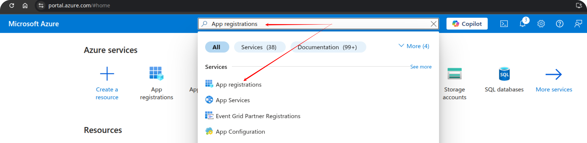

Click **New registration** and fill in the form:

- **Name**: Choose a name for your app.  
- **Supported account types**:  
  Select:  
  _Accounts in any organizational directory (Any Microsoft Entra ID tenant – Multitenant) and personal Microsoft accounts (e.g., Skype, Xbox)_
- **Redirect URI**:  
  - Platform: _Web_  
  - URI: `http://localhost:8080`
  
Click the **Register** button.

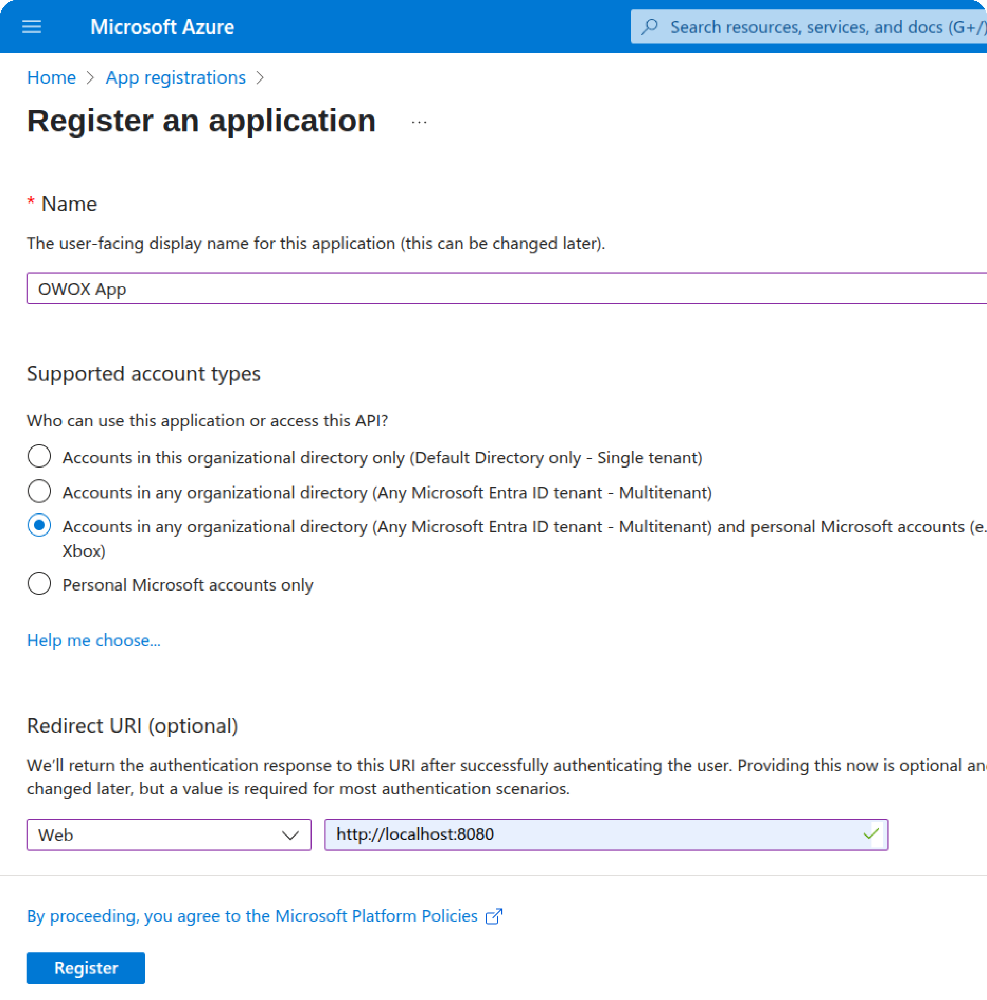

## Step 2: Generate Client Credentials

First, copy and save your **Client ID**:

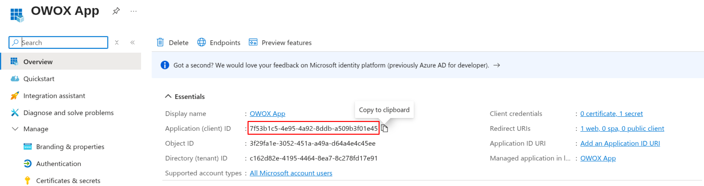

Then, go to **Client credentials** -> **Add a certificate or secret**.

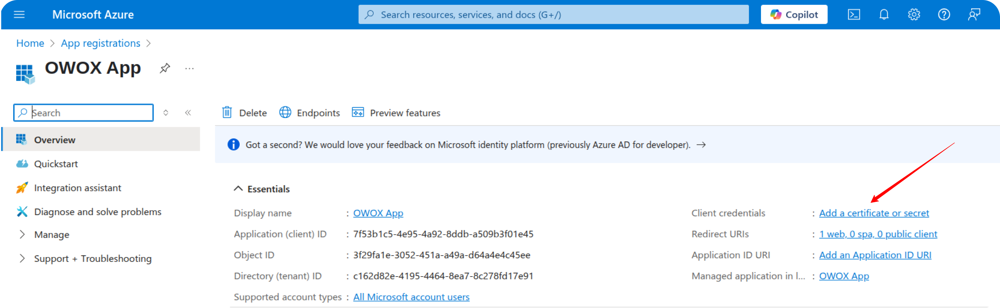

Click **New client secret**.

Provide a description (e.g., _Client secret for OWOX App_), choose the maximum expiration period (_730 days_), and click **Add**.

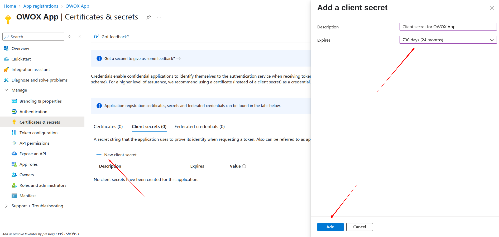

> ⚠️ **Important:** Copy and securely save the **client secret value**. You won't be able to see it again later.

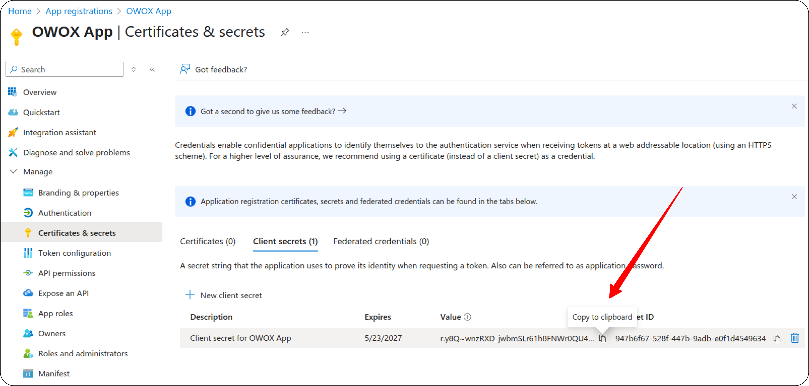

At this point, you have:

- **Client ID**
- **Client Secret**
- **Redirect URI**: `http://localhost:8080`

## Step 3: Get Account ID and Customer ID

1. Go to [https://ads.microsoft.com/](https://ads.microsoft.com/) and log in to your Microsoft Ads account.  
2. Your **Account ID** and **Customer ID** can be found in the URL.

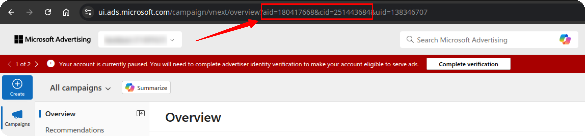

## Step 4: Get Your Developer Token

In the Microsoft Ads interface, go to **Settings → Developer Settings**.  

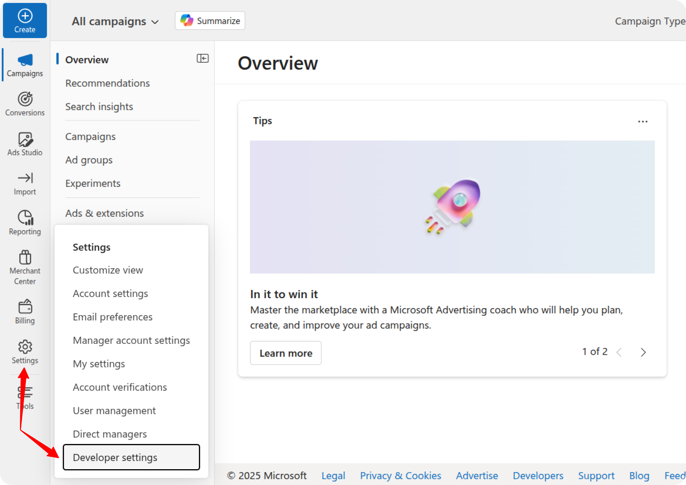

Click **Request Token**, and copy the generated **Developer Token**.  

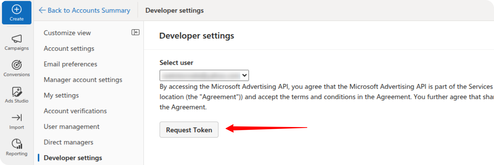

## Step 5: Generate an Authorization Code

Great! Create a URL by replacing `CLIENTID` with your **Client ID**:

``` code
https://login.microsoftonline.com/common/oauth2/v2.0/authorize?client_id=CLIENTID&response_type=code&redirect_uri=http://localhost:8080&scope=https://ads.microsoft.com/msads.manage offline_access
```

Open the URL in your browser. Log in and authorize the app by clicking **Accept**. After authorization, you will be redirected to:  
`http://localhost:8080/?code=YOUR_AUTHORIZATION_CODE`  

Copy the `code` value from the URL.

> Example:  
> If the redirect URL is:  
> `http://localhost:8080/?code=M.C519_BAY.2.U.0a895e39-774a-e677-b4bb-8589ce3e0beb`  
>Your **Authorization Code** is:  
>`M.C519_BAY.2.U.0a895e39-774a-e677-b4bb-8589ce3e0beb`

## Step 6: Exchange Authorization Code for a Refresh Token

Use [ReqBin](https://reqbin.com/) or **Postman** to exchange this code for a refresh token by making a **POST** request to

``` code
https://login.microsoftonline.com/common/oauth2/v2.0/token
```

with the following parameters in the **Body** tab (replace _YOUR_CLIENT_ID_, _YOUR_CLIENT_SECRET_ and _YOUR_AUTHORIZATION_CODE_ with actual values):

``` code
client_id=YOUR_CLIENT_ID&  
client_secret=YOUR_CLIENT_SECRET&  
grant_type=authorization_code& 
code=YOUR_AUTHORIZATION_CODE&  
redirect_uri=http://localhost:8080&  
scope=https://ads.microsoft.com/msads.manage offline_access
```

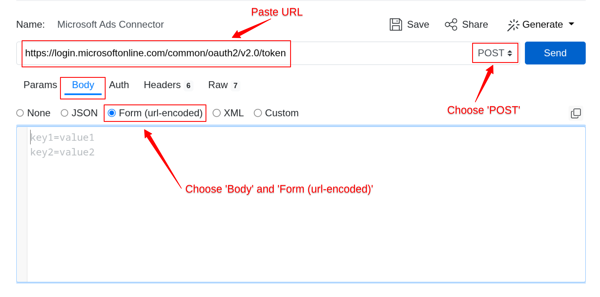

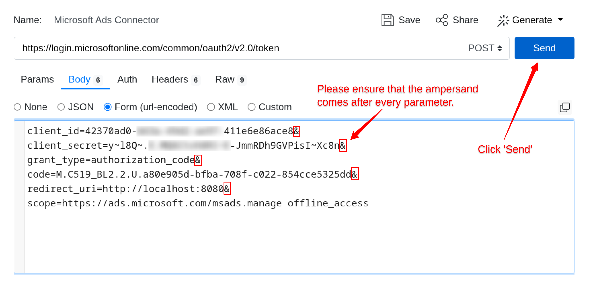

Clicks **Send** button. After a successful request, you will receive a **Refresh Token** in the response. Store it securely — this token will be used to authenticate API requests.

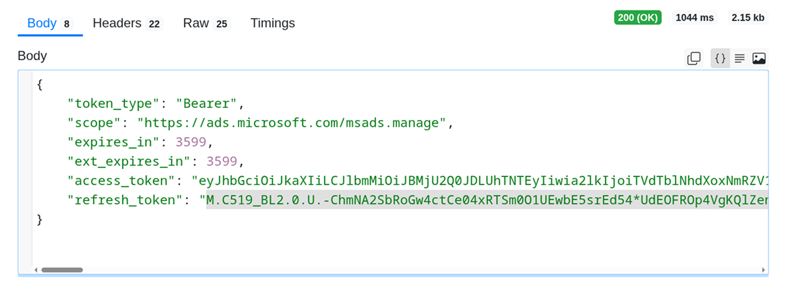

## ✅ Final Summary

At this point, you should have the following credentials:

- **Account ID**  
- **Customer ID**  
- **Developer Token**  
- **Client ID**  
- **Client Secret**  
- **Refresh Token**

These credentials are required to [connect to the Microsoft Ads source](GETTING_STARTED) and begin importing your advertising data.

## Troubleshooting Refresh Token Errors

If you encounter any errors while obtaining the refresh token, check the possible causes and recommended solutions below.

### Error: `Invalid client secret provided. Ensure the secret being sent in the request is the client secret value, not the client secret ID, for a secret added to app '(YOUR APP ID)'`

**Cause:**  
You are using the **Secret ID** instead of the **Secret Value** in your request.  
Only the **Secret Value** can be used to authenticate your app — the **Secret ID** will not work.

**Solution:**  

1. Return to **Step 2** and confirm that you copied the **Secret Value**, not the **Secret ID**.  
2. If the Secret Value is no longer visible (it is shown only once), create a **new Client Secret** in your app and copy the value immediately.  

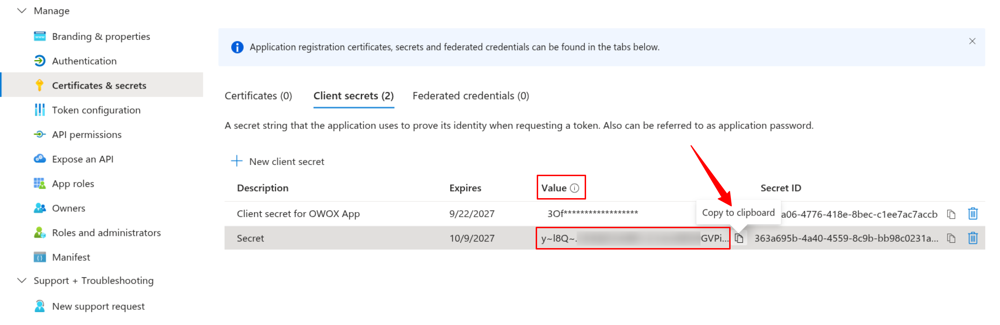

### Error: `The provided value for the 'code' parameter is not valid. The code has expired.`

**Cause:**  
The temporary authorization code has expired.  
Microsoft (and other platforms) issue short-lived authorization codes that must be exchanged for tokens within a limited time window (usually just a few minutes).

**Solution:**  
Repeat **Step 5** to obtain a new temporary authorization code and retry the request.

---

✅ **Tip:**  
Always generate and use the authorization code **immediately** after receiving it to avoid expiration issues.

## Troubleshooting and Support

If you encounter any other issues:

1. Please [visit Q&A](https://github.com/OWOX/owox-data-marts/discussions/categories/q-a) first
2. If you want to report a bug, please [open an issue](https://github.com/OWOX/owox-data-marts/issues)
3. Join the [discussion forum](https://github.com/OWOX/owox-data-marts/discussions) to ask questions or propose improvements
