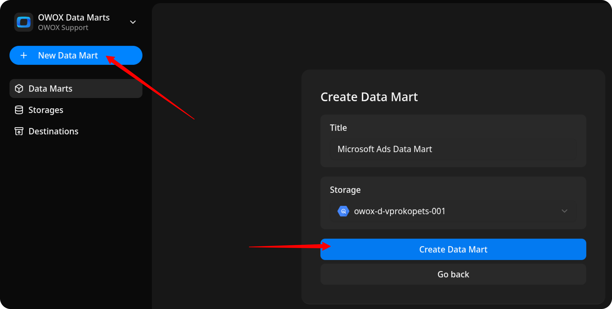
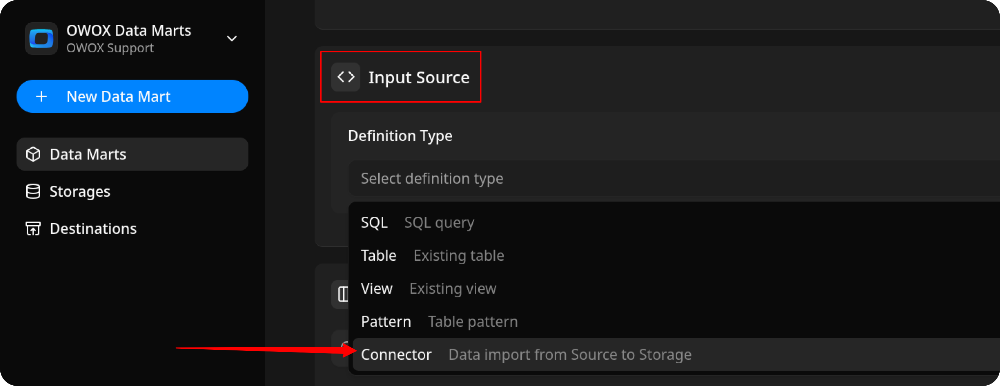
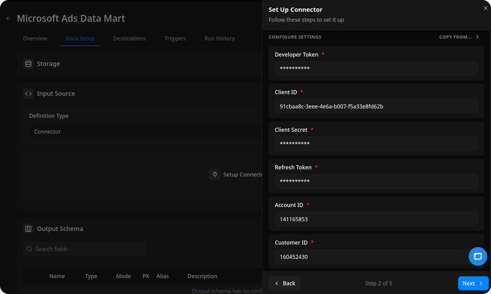
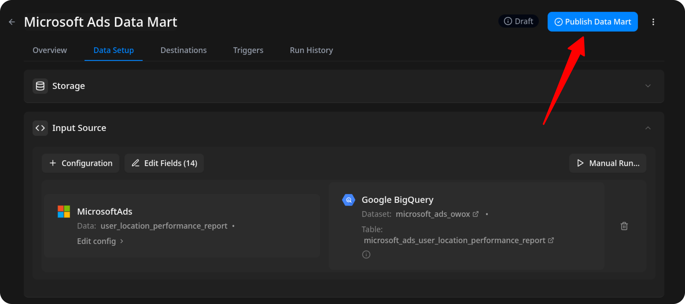
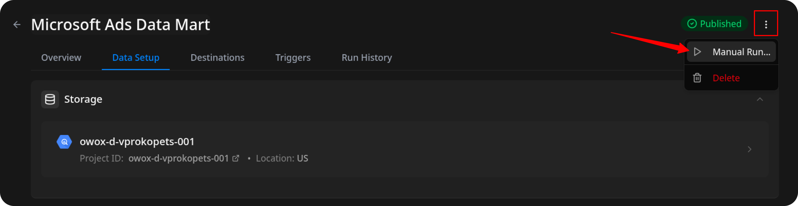
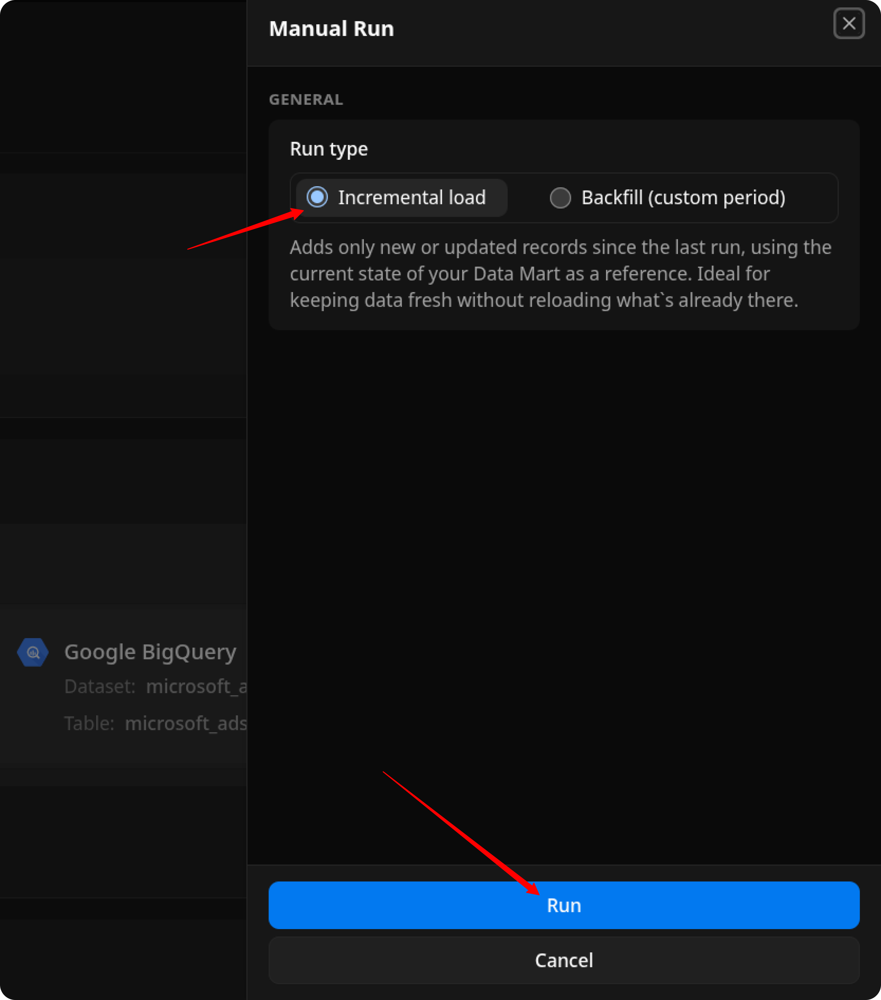
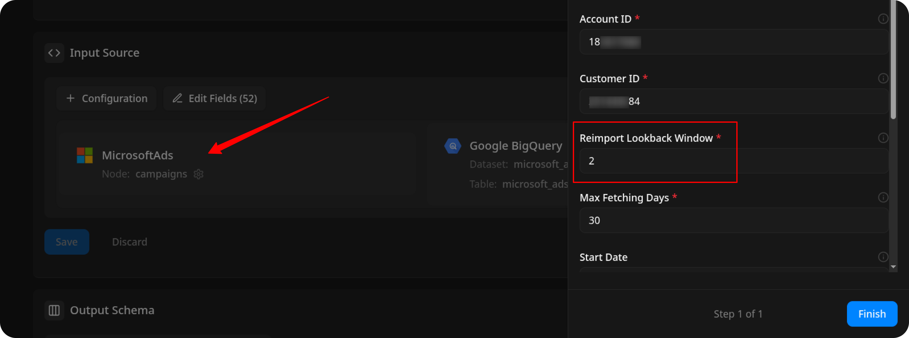
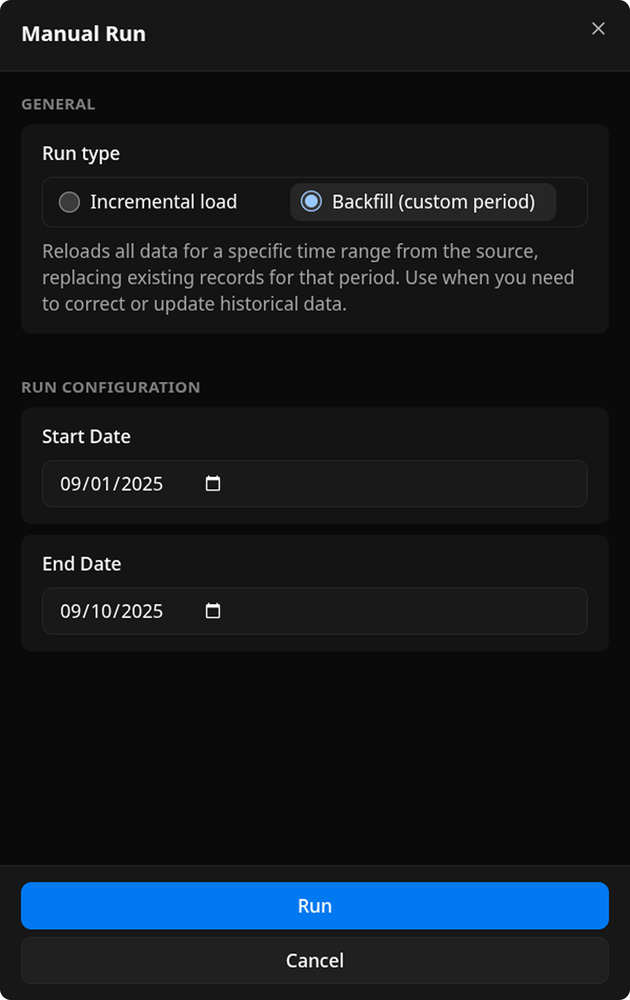
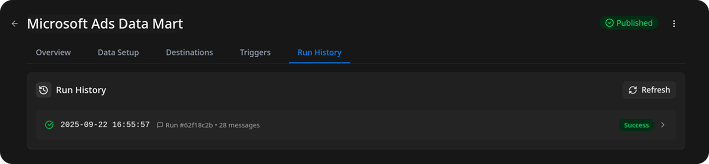
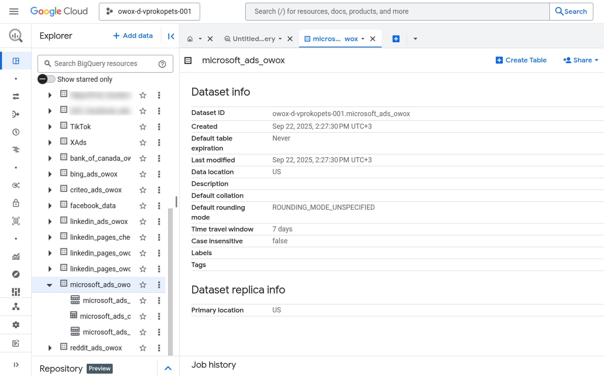

# How to Import Data from the Microsoft Ads Source

Before you begin, please ensure that:

- You have already obtained all required credentials, as described in [CREDENTIALS](CREDENTIALS.md).  
- You have [set up **OWOX Data Marts**](https://docs.owox.com/docs/getting-started/quick-start/) and created at least one storage in the **Storages** section.  

## Create the Data Mart

- Click **New Data Mart**.
- Enter a title and select the Storage.
- Click **Create Data Mart**.

1. Select **Connector** as the input source type.  
2. Click **Set up connector** and choose **Microsoft Ads**.  
3. Fill in the required fields with the credentials you obtained in the [CREDENTIALS](CREDENTIALS.md) guide.  
   - Leave the other fields as default.  
   - Proceed to the next step.

## Configure Data Import

1. Choose one of the available **endpoints**.  
   - To import spend, clicks, and impressions from an ad account, select the `Microsoft Ads Campaigns` endpoint.  
2. Select the required **fields**.  
3. Specify the **dataset** where the data will be stored (or leave the default).  
4. Click **Finish**, then **Publish Data Mart**.  

### Resolve Short Links

Ads often point to short links. OWOX can follow each short link and store the landing page next to it:

- **Ad Performance Report**: `FinalUrl`, `FinalMobileUrl` and `DestinationUrl` resolve into `FinalUrlParsed`, `FinalMobileUrlParsed` and `DestinationUrlParsed`.
- **Campaigns**: `FinalUrl` and `MobileFinalUrl` resolve into `FinalUrlParsed` and `MobileFinalUrlParsed`.

Keep the source field and its parsed field selected and enable **Process Short Links** under **Advanced** settings. OWOX selects `FinalUrl` and `FinalUrlParsed` on the Ad Performance Report by default. A parsed field holds the landing page for short links and the original value for other links.

OWOX resolves standard short links, such as `https://bit.ly/abc123`, on any domain. Links with several path parts resolve only on domains listed in the `CONNECTOR_SHORT_LINK_DOMAINS` environment variable. Your administrator sets this variable for the whole deployment. See [Environment Variables](https://docs.owox.com/docs/getting-started/deployment-guide/environment-variables/#connectors).

OWOX resolves each short link once per Data Mart and remembers the result for 30 days. Rows imported before you selected a parsed field keep their old values until you run a backfill.

## Run the Data Mart

You now have two options for importing data from Microsoft Ads:  

Option 1: Import Current Day's Data

Choose **Manual run → Incremental load** to load data for the **current day**.

> ℹ️ If you click **Incremental load** again after a successful initial load,  
> the connector will import: **Current day's data**, plus **Additional days**, based on the value in the **Reimport Lookback Window** field.

Option 2: Manual Backfill for Specific Date Range

- Choose **Backfill (custom period)** to load historical data.  

1. Select the **Start Date** and **End Date**.  
2. Click **Run**.  

The process is complete when the **Run history** tab shows the message: **"Success"**  

## Access Your Data

Once the run is complete, the data will be written to the dataset you specified earlier.  

If you encounter any issues:

1. Check the Run history for specific error messages
2. Please [visit Q&A](https://github.com/OWOX/owox-data-marts/discussions/categories/q-a) first
3. If you want to report a bug, please [open an issue](https://github.com/OWOX/owox-data-marts/issues)
4. Join the [discussion forum](https://github.com/OWOX/owox-data-marts/discussions) to ask questions or propose improvements
