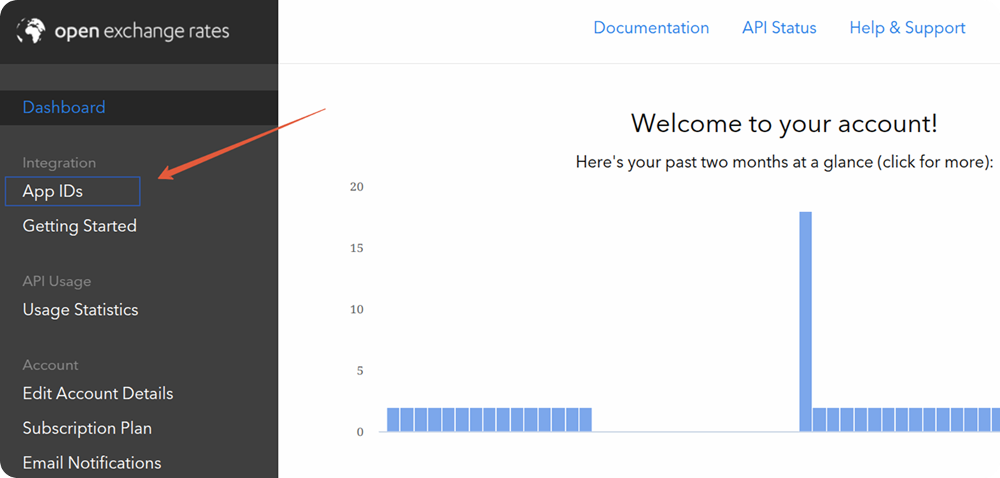
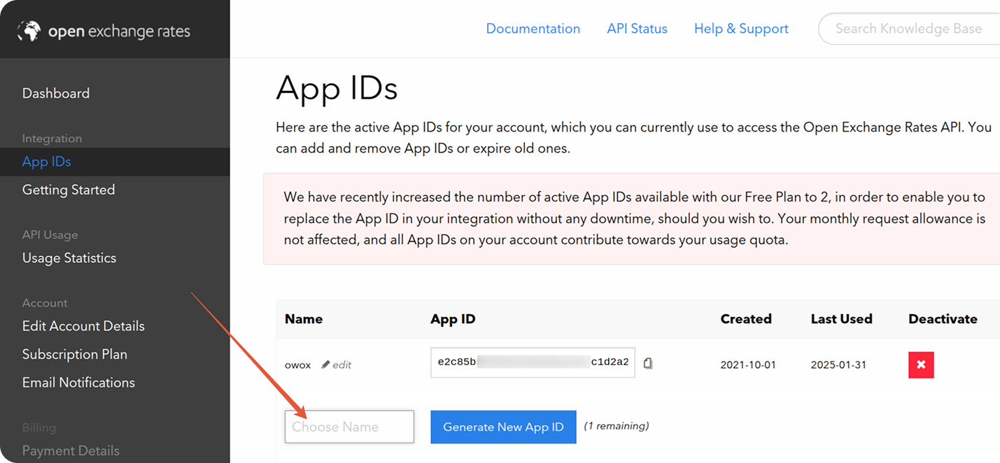
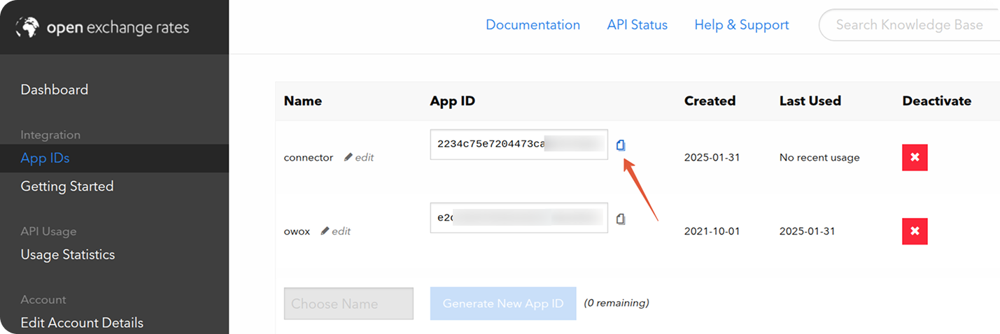

# How to obtain the App ID for the Open Exchange Rates source

Sign up on the [Open Exchange Rates](https://openexchangerates.org/) site.

Navigate to the Integration -> App IDs section.

Enter a name for your app, then click "**Generate New App ID**".

Copy the provided App ID.

## ✅ You’re Ready to Go

You can now use this App ID as described in the [Getting Started guide](GETTING_STARTED.md).

## Troubleshooting and Support

If you encounter any issues:

1. Please [visit Q&A](https://github.com/OWOX/owox-data-marts/discussions/categories/q-a) first
2. If you want to report a bug, please [open an issue](https://github.com/OWOX/owox-data-marts/issues)
3. Join the [discussion forum](https://github.com/OWOX/owox-data-marts/discussions) to ask questions or propose improvements
