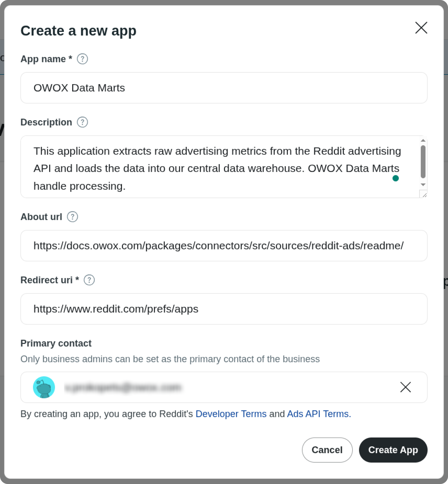
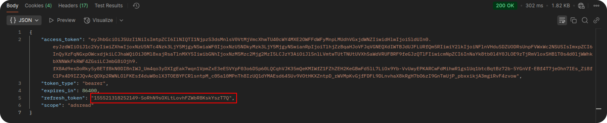

# How to obtain credentials for the Reddit Ads source

To connect to the Reddit Ads API and start importing data, follow the steps below.

## Step 1: Create a Reddit App

1. Go to the [Reddit Ads page](https://ads.reddit.com/) and log in with your Reddit account.  
2. In the left-hand panel, select **Developer Applications**.


1. Click **Create App** and fill in the form:  
   - **App Name**  
   - **Description**  
     Example:  
     _"This app will extract advertising metrics and store them in my data warehouse. The data will be processed via OWOX Data Marts to support daily marketing reporting and optimization efforts."_  
   - **About URL**: `https://docs.owox.com/packages/connectors/src/sources/reddit-ads/readme/`  
   - **Redirect URI**: `https://www.reddit.com/prefs/apps`  

2. Click **Create App**.  




After creating the app, you will see:  

- **App ID** (displayed just under the app name)  
- **Secret**  


## Step 2: Generate the Authorization Code

Construct the authorization URL below (replace `YOUR_APP_ID` with your actual App ID and remove any extra spaces):  

```text
https://www.reddit.com/api/v1/authorize
?client_id=YOUR_APP_ID
&response_type=code
&state=xyz_123
&redirect_uri=https://www.reddit.com/prefs/apps
&duration=permanent
&scope=adsread
```

1. Open the URL in your browser and press **Enter**.  
2. When prompted, click **Allow** (ensure you are logged in with the Reddit account that owns the ad account).  


You will then be redirected to a URL similar to:

```https://www.reddit.com/prefs/apps?solution=bbc1b48823f8bc04bbc1b48823f8bc04&js_challenge=1&token=54dba411ecc9fd270bca6277dc2a436162285b3fed6dc209303bbfab9aa42307&state=xyz_123&code=tPy-1pWJgMkzJrBmdFvIxWzS42girQ```

Copy the value of the `code` parameter — for example: ```tPy-1pWJgMkzJrBmdFvIxWzS42girQ```


## Step 3: Exchange Authorization Code for a Refresh Token

Next, exchange the authorization code for a **refresh token** using Postman or another tool (e.g., [ReqBin](https://reqbin.com/)).  

- **Endpoint:** `https://www.reddit.com/api/v1/access_token`  
- **Method:** `POST`  

**Request Parameters:**  

- `grant_type=authorization_code`  
- `code=YOUR_CODE` (the code obtained in Step 2)  
- `redirect_uri=https://www.reddit.com/prefs/apps`  

**Authentication:**

- **Auth Type:** Basic Auth  
- **Username:** Your App ID  
- **Password:** Your Secret  


Click **Send**. The response will include the **refresh token**.  



**Example JSON response:**

```json
{
  "access_token": "1234567890abcdef",
  "token_type": "bearer",
  "expires_in": 3600,
  "scope": "adsread",
  "refresh_token": "abcdef1234567890"
}
```

## Step 4: Set the User-Agent Header

Reddit requires a properly formatted `User-Agent` header for all API requests. Use the following format:  

`googleapps:owox-data-marts.redditads:v1.0.0 (by /u/your_reddit_username)`

> Replace `your_reddit_username` with your actual Reddit username.

## ✅ You're Ready

You now have all required credentials:

- **App ID**
- **Secret**
- **Redirect URI**: `https://www.reddit.com/prefs/apps`  
- **Refresh Token**  
- **User-Agent Header**  

You can now use these credentials as described in the [Getting Started guide](GETTING_STARTED.md).  
