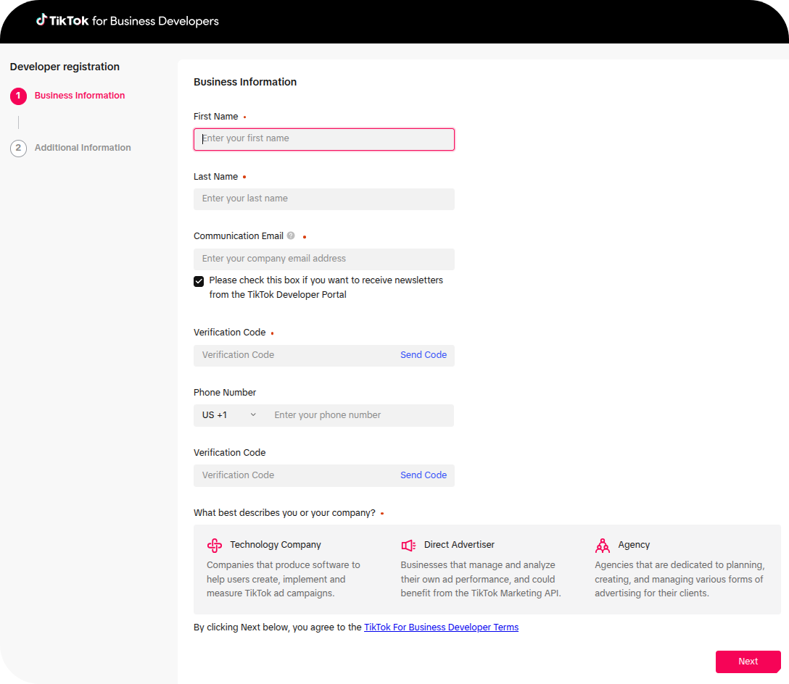
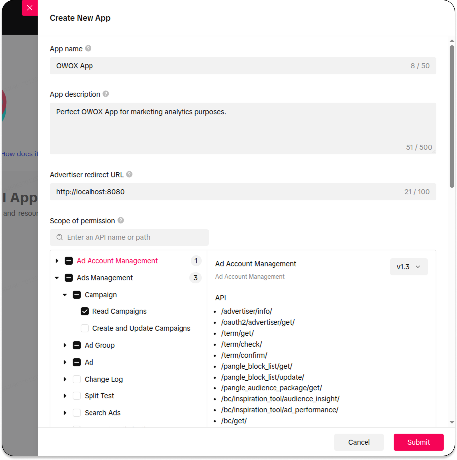
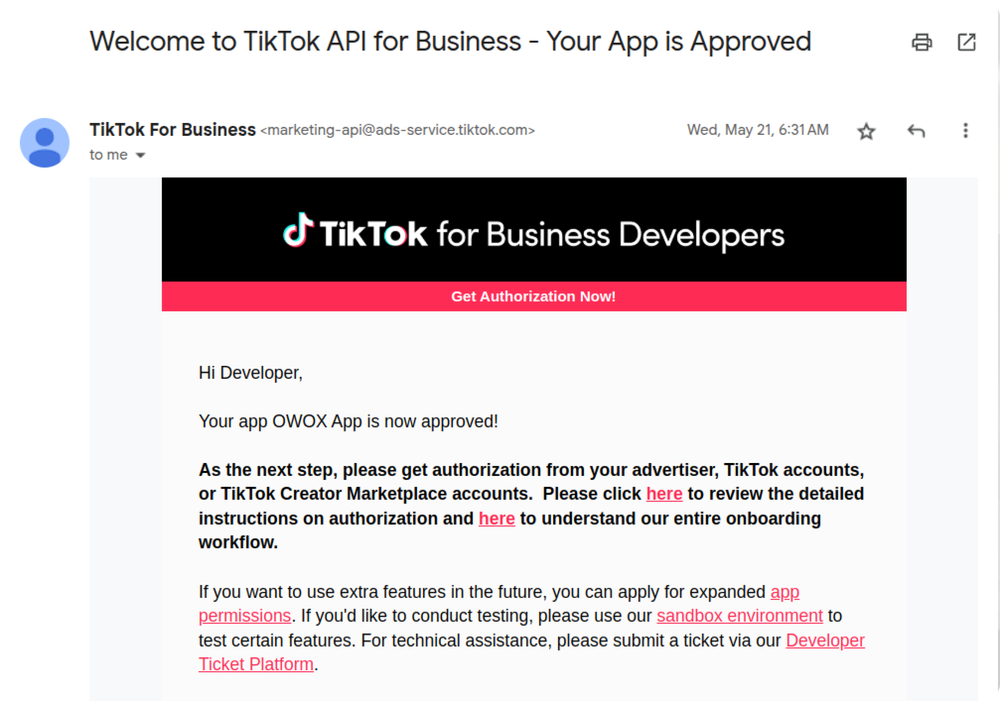
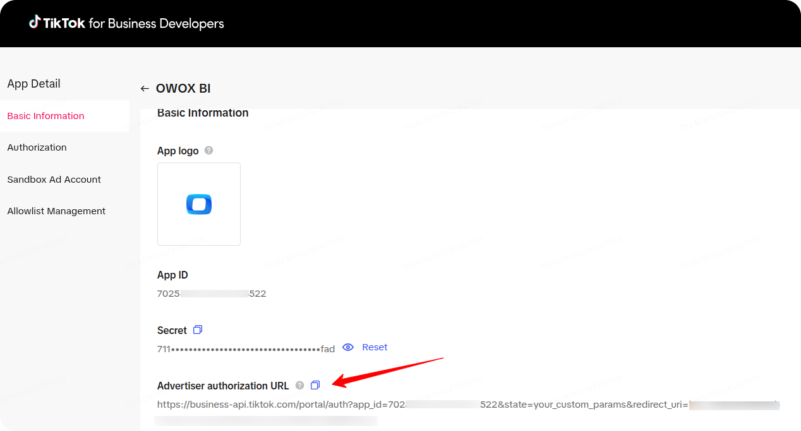
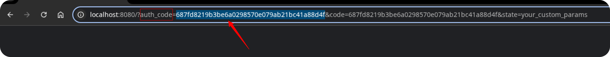
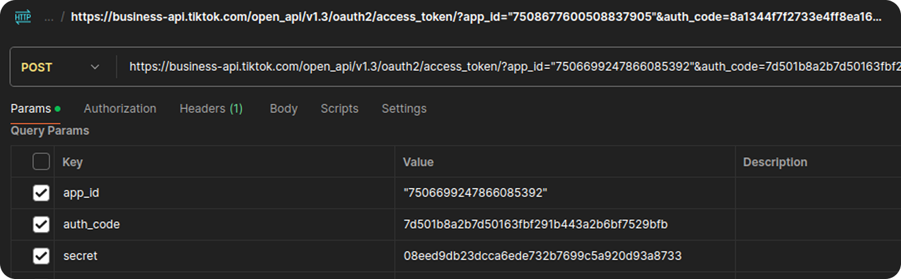
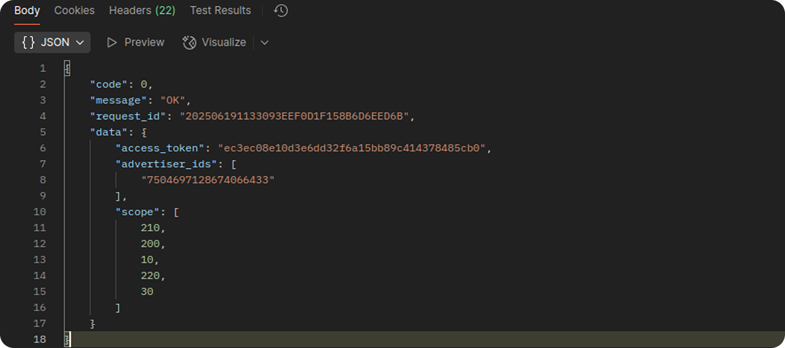

# Connect TikTok Ads Credentials

Use this guide to connect OWOX Data Marts to the TikTok Ads API.

You can connect in two ways:

1. [**OAuth**](#oauth): use this method when **Continue with TikTok** appears.
2. [**Access Token**](#access-token): use this method for manual setup.

OAuth gives most users the shortest path. It needs no developer app, so you skip TikTok's
app review. Manual setup requires an approved TikTok app, an access token, an App ID, and
an App Secret. TikTok reviews every app, which can take up to seven business days.

> **Self-hosted deployments:** If the **Continue with TikTok** button is not available, use the **Access Token** method.

**Before you start:** Use a TikTok for Business account that can access the target
advertiser account. Without access, TikTok returns a permission error or empty results.

## OAuth

1. Click **Continue with TikTok** in the connector settings.
2. Log in with a TikTok account that can access the advertiser account.
3. Approve access for the advertiser accounts you want to import.

TikTok returns the advertiser accounts your user can reach. OWOX stores the token and
lists those advertiser IDs.

Then enter the **Advertiser IDs** you want to import. Separate several IDs with commas.
See [where to find Advertiser IDs](GETTING_STARTED.md#set-up-the-connector).

Reconnect with TikTok in these cases:

- The user revokes app access.
- TikTok invalidates the grant.
- Required permissions change.
- The authorized user loses access to the advertiser account.

Next, open **Configure Data Import** and choose the data you want to fetch. See [Configure Data Import](GETTING_STARTED.md#configure-data-import).

## Access Token

Use this method when you need manual credentials. You will create a TikTok developer app
and generate an access token. If you already used **OAuth**, skip this section.

> **Before you start:** Step 4 sends your **App Secret** and your authorization code, then receives your **Access Token**.
> Use [Postman Desktop](https://www.postman.com/downloads/) or `curl` for better security.
> If you use [ReqBin](https://reqbin.com/), avoid shared computers.
> Do not save the request publicly.
> Delete the request or history after you copy the token.

## Step 1: Become a TikTok Developer

1. Open the [TikTok for Business Developers portal](https://business-api.tiktok.com/portal).
2. Log in with your TikTok for Business account.
3. Click **Become a Developer**.
4. Enter your first name, last name, communication email, and company type.
5. Click **Next**, then follow the prompts to finish your application.



## Step 2: Create and Configure the App

1. Open [My Apps](https://business-api.tiktok.com/portal/apps).
2. Click **Create an App**.
3. Enter an **App Name**, for example `OWOX Data Marts App`.
4. Enter an **App Description**. Explain why you need TikTok cost data.
5. Enter an **Advertiser Redirect URL**. Use `http://localhost:8080` for token generation.

TikTok reviewers read the description closely. A vague description slows approval. Use this
example as a model:

> Company Name provides financial control for e-commerce businesses. We track advertising
> costs across platforms. TikTok API access pulls detailed cost data from TikTok advertising
> accounts. This data feeds the OWOX Data Mart connector. We then correlate TikTok ad spend
> with sales performance automatically. Without this access, we cannot analyze ROI precisely
> or optimize ad budgets. Manual data entry would replace real-time financial insight.

Next, select the permission scopes. Use the search bar, or browse the list:

| Scope group | Select |
| --- | --- |
| Ad Account Management | `Ad Account Information → Read Ad Account Information` |
| Ads Management | `Campaign → Read Campaigns` |
| Ads Management | `Ad Group → Read Ad Groups` |
| Ads Management | `Ad → Read Ads` |
| Audience Management | `Read Custom Audiences` |
| Reporting | All reporting levels |

OWOX only reads data. The connector never creates or changes campaigns, ad groups, or ads.

Click **Submit** to send the app for review.



TikTok can take up to **seven business days** to review your app. If TikTok rejects the app,
rewrite the description more clearly and resubmit. TikTok emails you after approval.



## Step 3: Authorize an Advertiser and Get the Authorization Code

1. Open your app's detail page.
2. Copy the **Advertiser authorization URL**.
3. Paste the URL into your browser.
4. Sign in and approve the advertiser accounts you want to import.



TikTok redirects you to your **Advertiser redirect URL**. That URL carries an `auth_code`
query parameter. Copy the `auth_code` value from the address bar.

> **Note:** You may see `This site can't be reached`.
> This is expected.
> The localhost link does not open a real site.
> Copy the `auth_code` from the address bar.



> ⚠️ **The `auth_code` expires in one hour, and it works only once.** Exchange it right away.
> If it expires or fails, repeat this step to get a new code.

## Step 4: Exchange the Code for an Access Token

Exchange the `auth_code` for an access token using [Postman Desktop](https://www.postman.com/downloads/), `curl`, or [ReqBin](https://reqbin.com/).

Send a `POST` request to:

```text
https://business-api.tiktok.com/open_api/v1.3/oauth2/access_token/
```

Set the header `Content-Type: application/json`. This endpoint accepts JSON only. A
form-encoded body fails.

Send this JSON body. Replace all three values:

```json
{
  "app_id": "YOUR_APP_ID",
  "secret": "YOUR_APP_SECRET",
  "auth_code": "CODE_FROM_THE_PREVIOUS_STEP"
}
```

Find your **App ID** and **App Secret** in **My Apps → App Detail → Basic Information**.



Click **Send**. A successful response returns `"code": 0` and includes:

- `access_token`: authorizes every later API call.
- `advertiser_ids`: the advertiser accounts this token can reach.



Copy the **access token** and store it securely. Copy the advertiser IDs you plan to import.

> **TikTok long-term access tokens do not expire.** You do not need to refresh them.
> To end access, revoke the token in your TikTok app, then repeat Steps 3 and 4.

## Step 5: Use the Credentials

You now have the **App ID**, **App Secret**, **Access Token**, and your **Advertiser IDs**.
Enter them in the Data Mart setup. Follow [Getting Started](GETTING_STARTED.md) to fill in
the connector fields.

## Troubleshooting Credential Setup

Use this section for authorization code and access token errors.

### Error: the response returns a non-zero `code`

**Cause:** TikTok rejected the request. The `message` field explains why.

**Solution:** Read the `message` value, then match it with the cases below.

### Error: `auth_code` is invalid or expired

**Cause:** The code expired, or you already exchanged it. TikTok codes last one hour and work once.

**Solution:** Repeat **Step 3** to get a new `auth_code`. Exchange it right away.

### Error: the request fails with a parameter or format error

**Cause:** You sent a form-encoded body. The `/oauth2/access_token/` endpoint accepts JSON only.

**Solution:** Set the header `Content-Type: application/json`. Send the three parameters as a JSON object.

### Error: app permission or scope errors

**Cause:** Your app lacks a required scope, or TikTok has not approved it yet.

**Solution:** Confirm the app shows an approved status. Check that it holds every scope in **Step 2**. Adding a scope requires a new review and a new authorization.

### The response returns no advertiser IDs

**Cause:** The authorizing user approved no advertiser account, or reaches none.

**Solution:** Repeat **Step 3**. Approve at least one advertiser account. Confirm your TikTok user can access it in [TikTok Ads Manager](https://ads.tiktok.com/).

### Error: `To fetch advertiser data, both AppId and AppSecret must be provided`

**Cause:** The Data Mart holds an access token, but no App ID or App Secret.

**Solution:** Open the connector settings. Fill in **App ID** and **App Secret** from **My Apps → App Detail → Basic Information**.

For errors after you save credentials, see [Troubleshooting TikTok Ads imports](TROUBLESHOOTING.md).

## Support

If you run into other issues:

1. Check [Troubleshooting TikTok Ads imports](TROUBLESHOOTING.md) for run, permission, and account access errors.
2. Search [Q&A](https://github.com/OWOX/owox-data-marts/discussions/categories/q-a).
3. Open an [issue](https://github.com/OWOX/owox-data-marts/issues) to report a bug.
4. Join the [discussion forum](https://github.com/OWOX/owox-data-marts/discussions).
