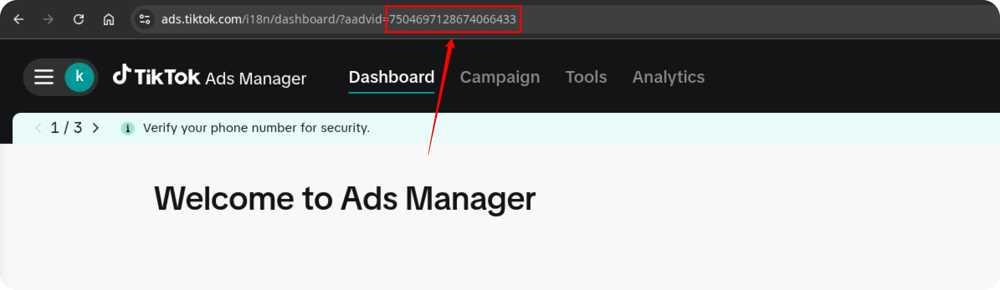

# Getting Started with TikTok Ads Source

This guide will help you set up and start using the TikTok Ads Source to import your advertising data into Google Sheets / Google BigQuery.

## Prerequisites

Before you begin, ensure you have the following:

1. A **Google account** with access to Google Sheets
2. A **TikTok For Business account** with access to the advertising data you want to import
3. For the **Google BigQuery** template:
   - A **Google Cloud project** with access to BigQuery
4. A valid **Access Token** for the TikTok Business API  
   → See [CREDENTIALS.md](CREDENTIALS.md) for detailed instructions on how to obtain it.

## Setup Instructions

### 1. Copy the Template

To begin importing data from TikTok Ads, start by making a copy of one of the following templates:

- [**TikTok Ads → Google Sheets. Template**](https://docs.google.com/spreadsheets/d/15AujaJ_x-ibEqs2u3DwvC8qV0hYC7oO1b1LGLEen1mQ/copy)
- [**TikTok Ads → Google BigQuery. Template**](https://docs.google.com/spreadsheets/d/1I7cThXo24rwaQgx2H2Jsh0Z5Acv2ydh7bDtdEP8mBEQ/copy)

### 2. Configure the Source

1. In your copy of the spreadsheet, go to the "Config" sheet
2. Fill in the required configuration parameters:
- **Start Date**
- **Advertiser IDs**
- **Fields**
- **Destination Dataset ID** (for **Google BigQuery** template)
- **Destination Location** (for **Google BigQuery** template)

The import will begin from the selected **Start Date**.  
> ⚠️ **Note:** Using a long date range may cause the import to fail due to the high volume of data.

You can find your **Advertiser ID** on the left bar in [TikTok for Business](https://ads.tiktok.com/).  

Copy and paste the ID into the spreadsheet:  

Some fields are pre-filled by default.  
To include additional fields, go to the **Fields** tab and check the boxes next to the fields you want to include.

If you're using the **Google BigQuery** template, also provide:

- **Destination Dataset ID** in the format: `projectid.datasetid`
- **Destination Location**

> ℹ️ If the specified dataset doesn't exist, it will be created automatically.

Open the menu: **OWOX → Manage Credentials**

Enter your credentials obtained by following [**TikTok Ads Source Authentication Guide**](CREDENTIALS.md)

### 3. Run the Source

There are several ways to run the source:

1. **Manual Run**:
   - From the custom menu, select "OWOX" > "Import New Data"
   - The import will start immediately and display progress in the "Logs" sheet

2. **Scheduled Run**:
   - To set up a daily run, select "OWOX" > "Schedule" > "Set Daily Schedule"
   - To set up an hourly run, select "OWOX" > "Schedule" > "Set Hourly Schedule"
   - To remove all scheduled runs, select "OWOX" > "Schedule" > "Delete All Schedules"

### Getting Help

If you encounter issues not covered in this guide:

1. Check the "Logs" sheet for specific error messages
2. Please [visit Q&A](https://github.com/OWOX/owox-data-marts/discussions/categories/q-a) first
3. If you want to report a bug, please [open an issue](https://github.com/OWOX/owox-data-marts/issues)
4. Join the [discussion forum](https://github.com/OWOX/owox-data-marts/discussions) to ask questions or propose improvements 