# How to Import Data from the TikTok Ads Source

Before proceeding, please make sure that:

- You have already created an **access token**, as described in [CREDENTIALS.md](CREDENTIALS.md).
- You [have run **OWOX Data Marts**](https://docs.owox.com/docs/getting-started/quick-start/) and created at least one storage in the **Storages** section.  

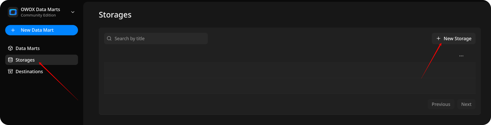

## Create the Data Mart

- Click **New Data Mart**.
- Enter a title and select the Storage.
- Click **Create Data Mart**.

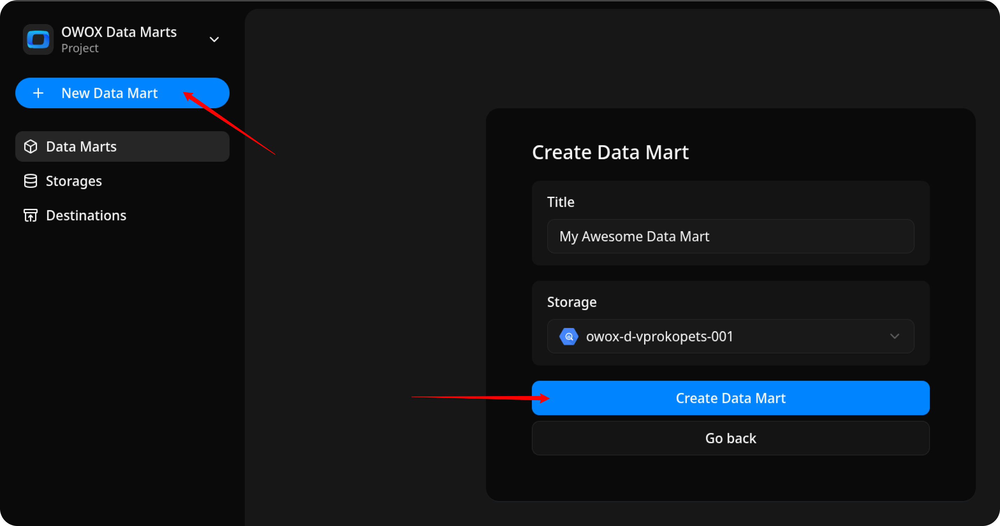

## Set Up the Connector

1. Select **Connector** as the input source type.  
2. Click **Set up connector** and choose **TikTok Ads**.  
3. Fill in the required fields:  
   - **Access Token** – paste the token you generated earlier.  
   - **App ID** and **App Secret** – available in the **Basic Information** section of your TikTok app.  
   - **Advertiser ID** – paste the ID you received together with the access token, or retrieve it directly from [TikTok Ads Manager](https://ads.tiktok.com/).  
4. Set **Data Level** if you need a performance reporting grain other than the default. It applies to `ad_insights` and `ad_insights_by_country` and supports:
   - `AUCTION_ADVERTISER`
   - `AUCTION_CAMPAIGN`
   - `AUCTION_ADGROUP`
   - `AUCTION_AD` (default)
5. Leave the remaining fields as default and proceed to the next step.

> If this connector has already loaded data, do not change **Data Level** for the same destination table. Create a new Data Mart or use a new destination table so records are merged with the correct unique keys.

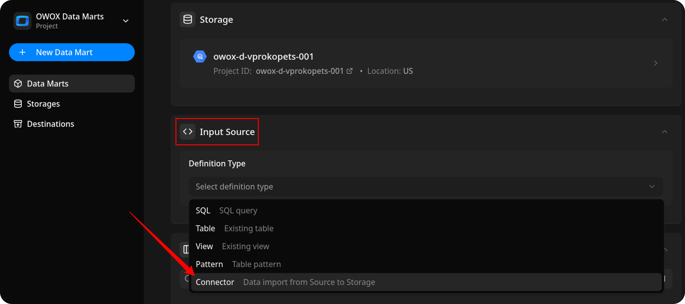

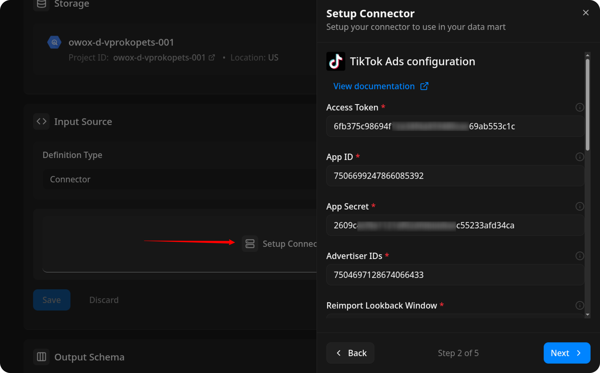

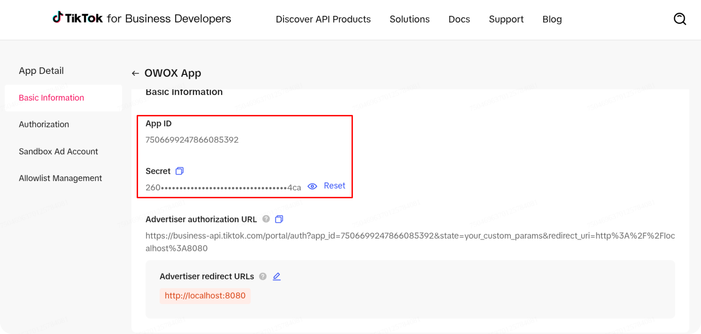

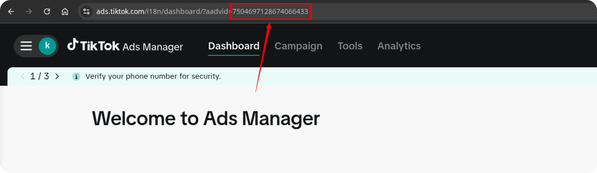

## Configure Data Import

### Pair Data Level with Fields

Choose **Data Level** before selecting fields. For `ad_insights` and `ad_insights_by_country`, TikTok returns rows at the selected reporting grain, and OWOX pins the matching unique-key fields so rows can be merged correctly.

Use `AUCTION_AD` when you need daily metrics per ad. Keep `ad_id`, `stat_time_day`, and `advertiser_id` selected.

Use `AUCTION_ADGROUP` when you need daily metrics per ad group. Keep `adgroup_id`, `stat_time_day`, and `advertiser_id` selected.

Use `AUCTION_CAMPAIGN` when you need daily metrics per campaign. Keep `campaign_id`, `stat_time_day`, and `advertiser_id` selected.

Use `AUCTION_ADVERTISER` when you need advertiser-level daily totals. Keep `stat_time_day` and `advertiser_id` selected.

Use `ad_insights_by_country` when you also need a geographic breakdown. It follows the same **Data Level** grain and adds `country_code` to the required fields.

`advertiser_id` is always required: if **Advertiser IDs** lists more than one advertiser, they write into the same destination table, and `advertiser_id` is what keeps their rows from merging into each other.

You can add any supported metrics to the required fields, but do not remove the required fields from the schema. If you change **Data Level** after data has already been loaded, use a new Data Mart or destination table.

1. Choose one of the available **endpoints**. For performance reporting, use `ad_insights`; use `ad_insights_by_country` when you also need the `country_code` breakdown.
2. Select the required **fields**. For performance endpoints, the required unique-key fields are pinned based on the **Data Level** value you selected during connector setup.
3. Specify the **dataset** where the data will be stored (or leave the default).  
4. Click **Finish**, then **Publish Data Mart**.

See [Data Level for Performance Nodes](README.md#data-level-for-performance-nodes) in the README for the full required-fields table per level.

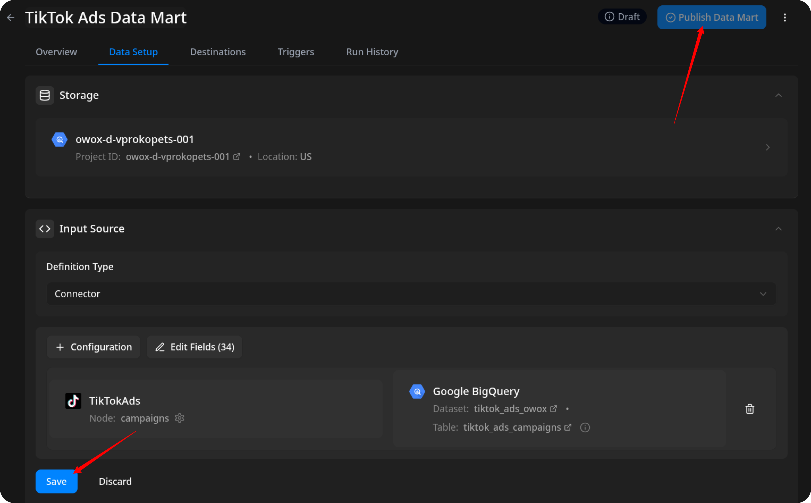

## Run the Data Mart

You now have two options for importing data from TikTok Ads:  

Option 1: Import Current Day's Data

Choose **Manual run → Incremental load** to load data for the **current day**.

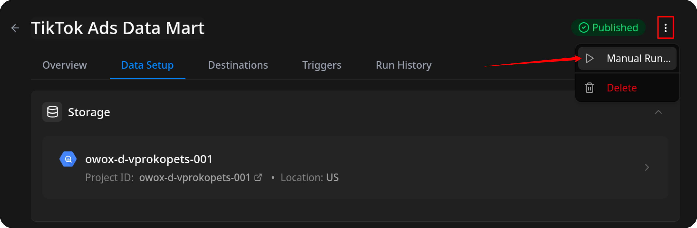

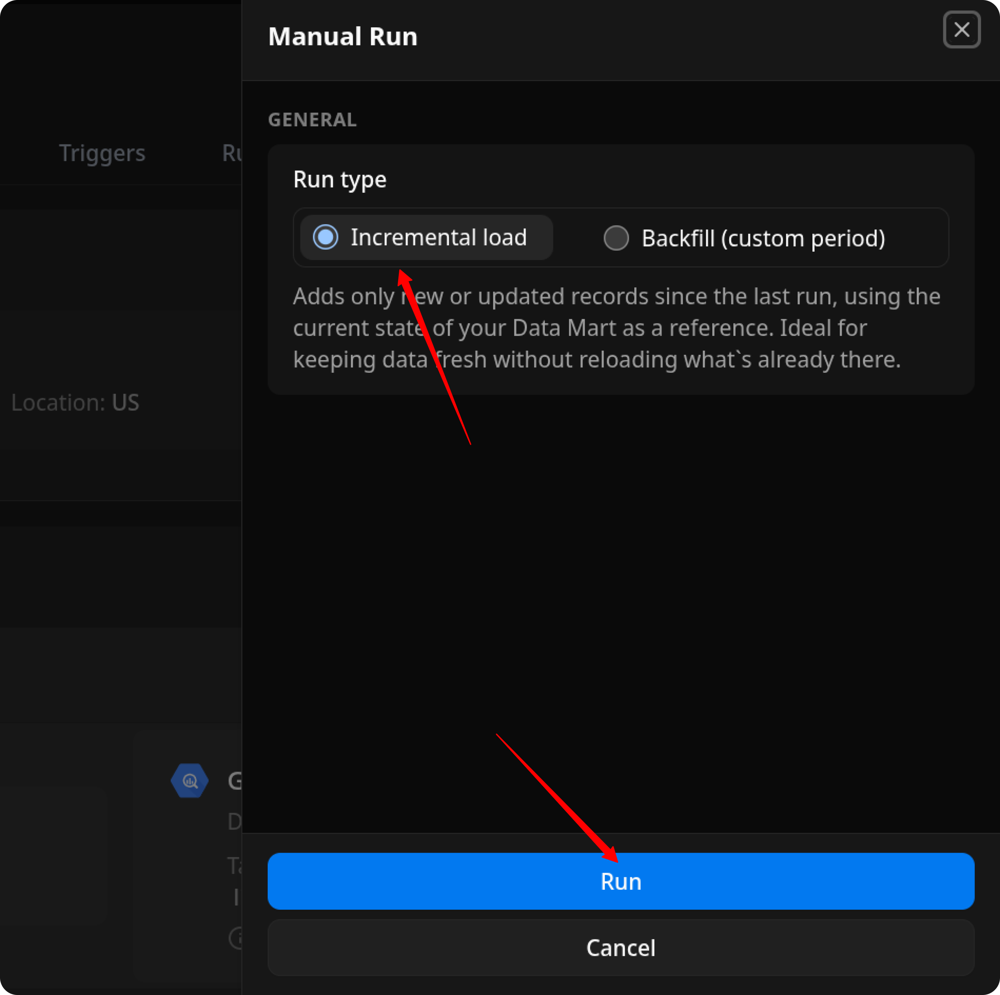

> ℹ️ If you click **Incremental load** again after a successful initial load,  
> the connector will import: **Current day's data**, plus **Additional days**, based on the value in the **Reimport Lookback Window** field.

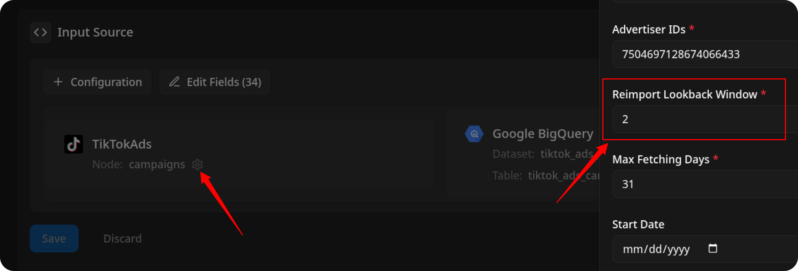

Option 2: Manual Backfill for Specific Date Range

Choose **Backfill (custom period)** to load historical data.  

1. Select the **Start Date** and **End Date**.
2. Click the **Run** button.

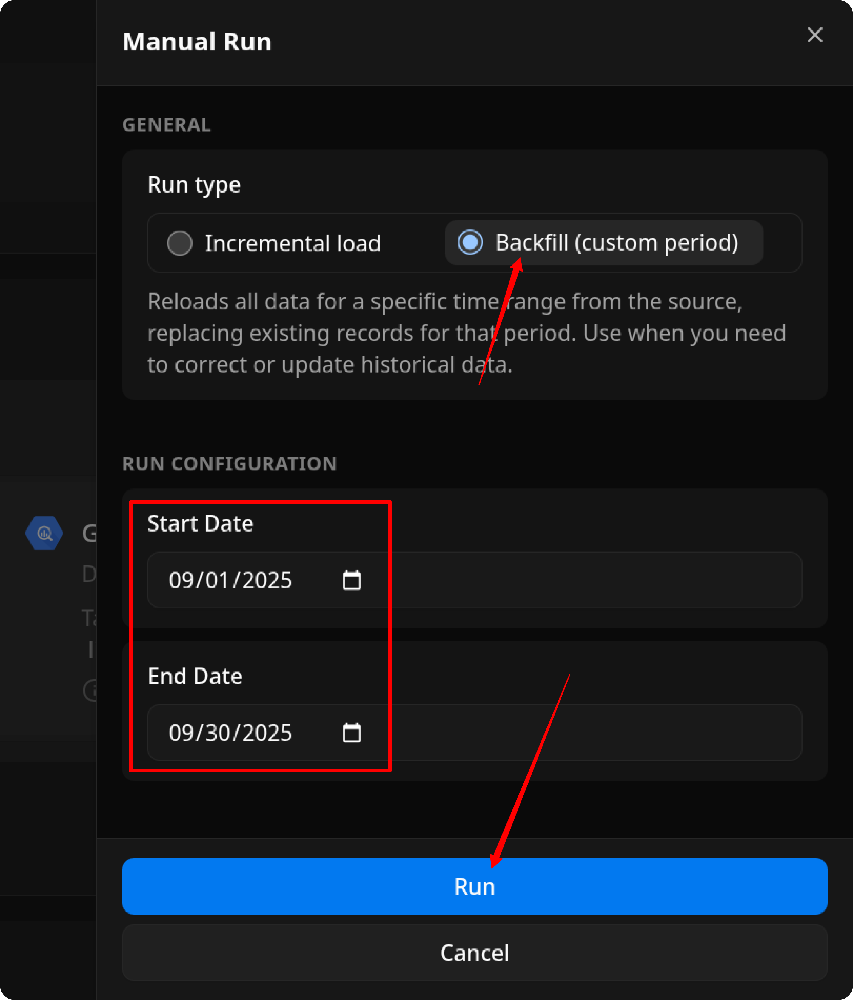

The process is complete when the **Run history** tab shows the message:  
**"Success"**  

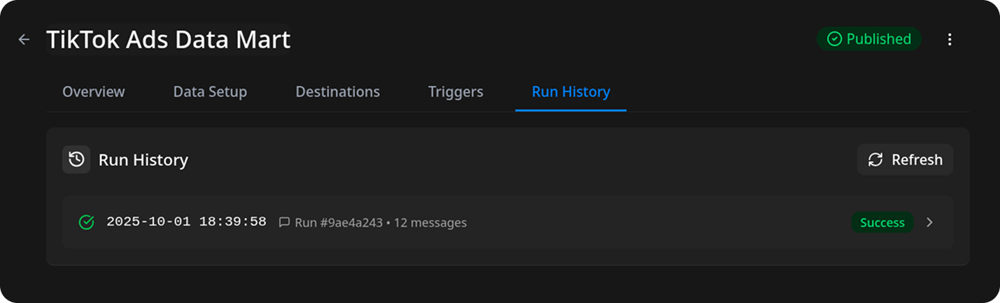

## Access Your Data

Once the run is complete, the data will be written to the dataset you specified earlier.

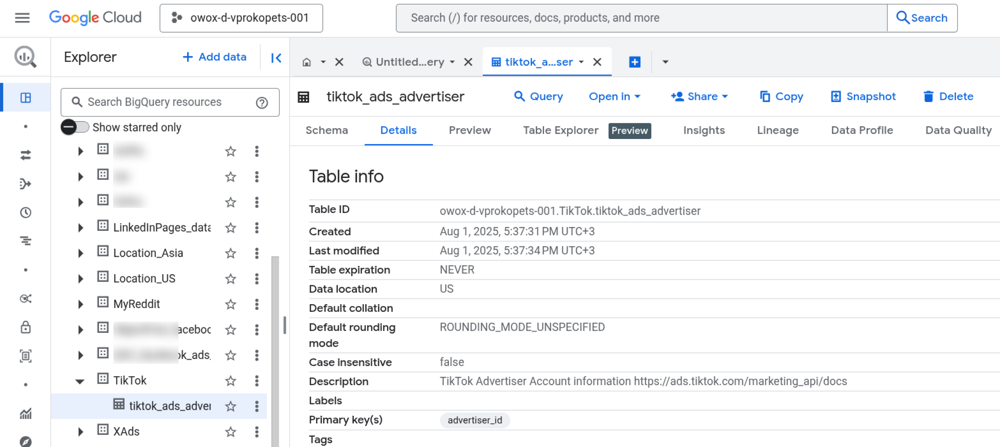

If you encounter any issues:

1. Check the Run history for specific error messages
2. Please [visit Q&A](https://github.com/OWOX/owox-data-marts/discussions/categories/q-a) first
3. If you want to report a bug, please [open an issue](https://github.com/OWOX/owox-data-marts/issues)
4. Join the [discussion forum](https://github.com/OWOX/owox-data-marts/discussions) to ask questions or propose improvements
