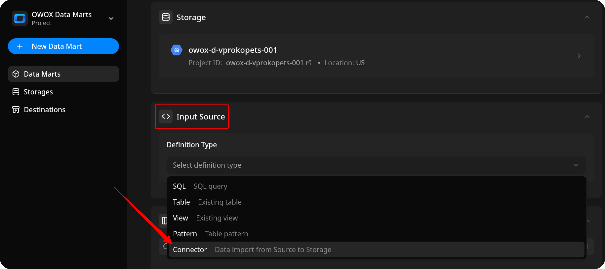
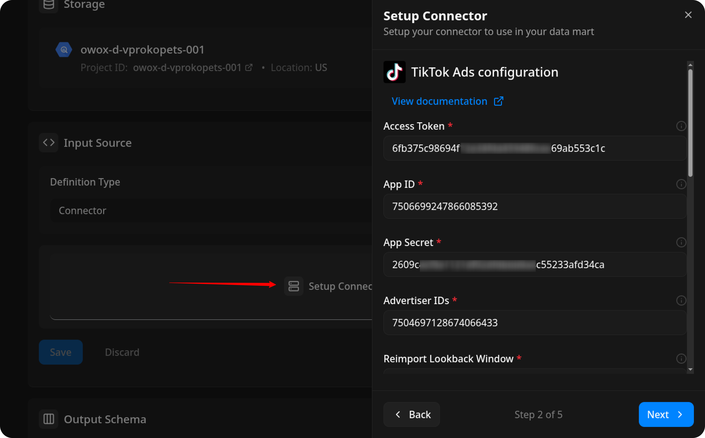
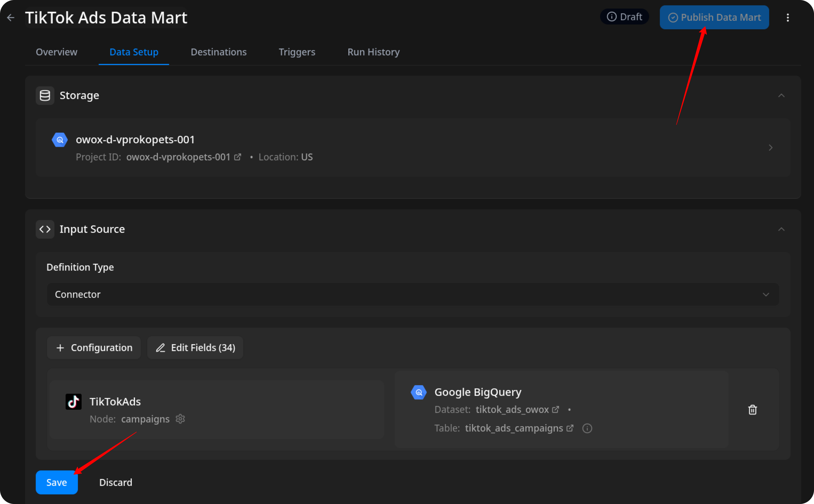
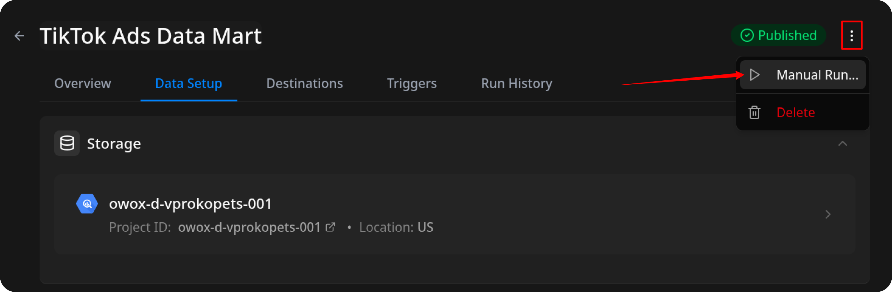
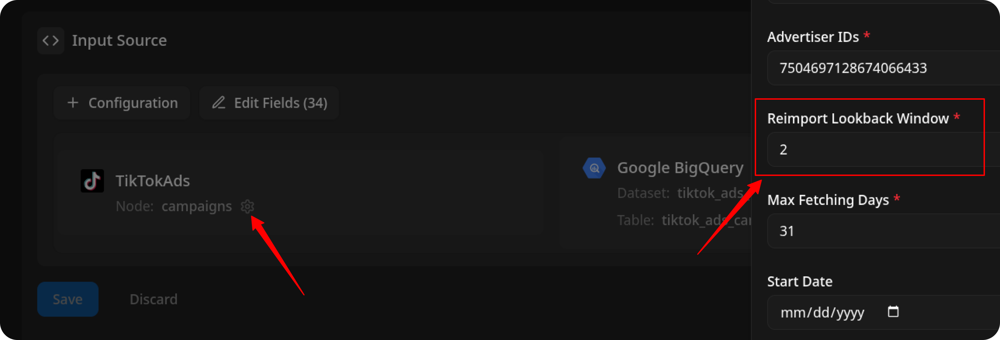
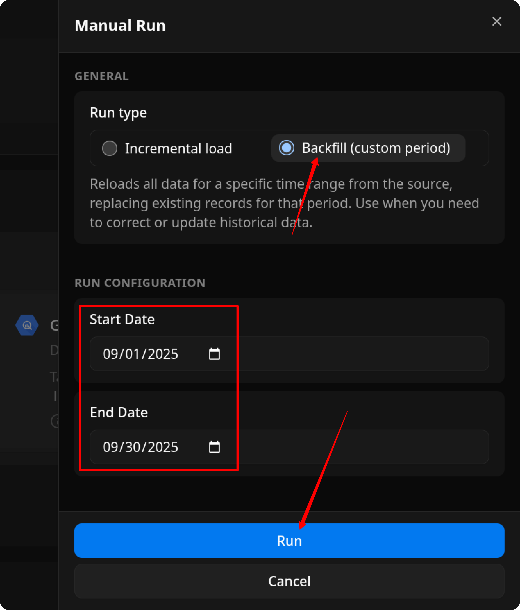
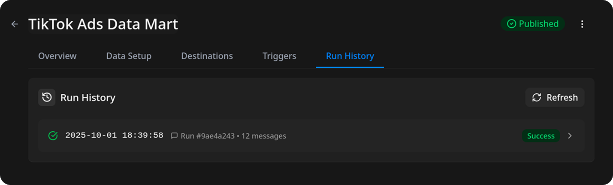
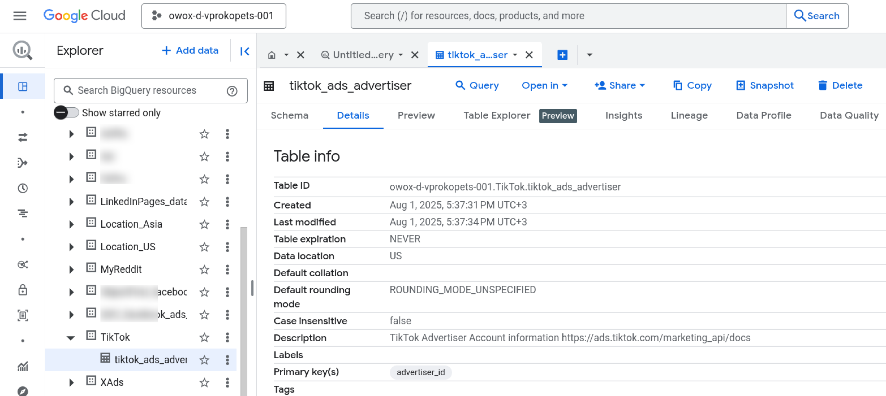

# Import Data from TikTok Ads

Use this guide to create a TikTok Ads Data Mart.

## Before You Start

Check these items before you create the Data Mart:

- You have set up OWOX Data Marts.
- You have at least one OWOX storage.
- You can access the target TikTok advertiser account.
- You know your numeric Advertiser IDs.
- You chose an authentication method in [Credentials](CREDENTIALS.md).

For storage setup, see [Storage Management](https://docs.owox.com/docs/storages/manage-storages/#adding-a-new-storage).

For a general connector walkthrough, see [Connector-based Data Mart](https://docs.owox.com/docs/getting-started/setup-guide/connector-data-mart/).

## Create the Data Mart

1. Click **New Data Mart**.
2. Enter a title.
3. Select a storage.
4. Click **Create Data Mart**.

If you have no storage yet, click **New Storage**. You can create the storage now and configure it later.

## Set Up the Connector

1. Select **Connector** as the input source type.
2. Click **Set up connector** and choose **TikTok Ads**.
3. Choose your authentication method.

For OAuth, click **Continue with TikTok**, then sign in with a TikTok user who can access the
advertiser account. If the button does not appear, use the **Access Token** method.

For manual authentication, fill in these fields:

- **Access Token**: paste the token from [Credentials](CREDENTIALS.md).
- **App ID**: enter your TikTok App ID.
- **App Secret**: enter your TikTok App Secret.

Find the App ID and App Secret in **My Apps → App Detail → Basic Information**.

Then fill in **Advertiser IDs**. Use numeric IDs only. To import from several advertisers,
separate the IDs with commas. You receive these IDs with the access token. You can also find
them in [TikTok Ads Manager](https://ads.tiktok.com/). The authorized TikTok user must access
every listed advertiser.

### Choose Data Level Before Fields

**Data Level** sets the reporting grain for `ad_insights` and `ad_insights_by_country`. Choose
it before you select fields. OWOX pins the matching unique-key fields so rows merge correctly.

| Data Level | Use it for | Pinned fields |
| --- | --- | --- |
| `AUCTION_AD` (default) | Daily metrics per ad. | `ad_id`, `stat_time_day`, `advertiser_id` |
| `AUCTION_ADGROUP` | Daily metrics per ad group. | `adgroup_id`, `stat_time_day`, `advertiser_id` |
| `AUCTION_CAMPAIGN` | Daily metrics per campaign. | `campaign_id`, `stat_time_day`, `advertiser_id` |
| `AUCTION_ADVERTISER` | Advertiser-level daily totals. | `stat_time_day`, `advertiser_id` |

`ad_insights_by_country` uses the same grain and adds `country_code` to the pinned fields.

`advertiser_id` is always pinned. **Advertiser IDs** can list several advertisers that write
into one destination table. At `AUCTION_ADVERTISER` no other field tells their rows apart.

Add any metrics you need. Do not remove the pinned fields. A run fails with
`Missing required unique fields` when a pinned field is missing.

> ⚠️ Do not change **Data Level** after a run has loaded data into a table. New rows would
> merge on a different key structure. Use a new Data Mart or a new destination table instead.

## Configure Data Import

1. Choose an endpoint.
2. Select fields, or keep the defaults.
3. Enter the target dataset.
4. Click **Finish**.
5. Click **Publish & Run Data Mart**.

OWOX writes the connector tables into this destination. Your storage sets the field label, such
as **Dataset** for BigQuery or **Database** for Amazon Redshift. For your storage, see
[Supported Storages](https://docs.owox.com/docs/storages/supported-storages/).

For spend, impressions, clicks, and conversions, choose **Ad Performance** (`ad_insights`). Use
**Ad Performance by Country** (`ad_insights_by_country`) when you also need a country breakdown.

For endpoint details, see [Endpoints and Fields](ENDPOINTS_AND_FIELDS.md).

If OWOX disables **Publish & Run Data Mart**, check the storage. OWOX cannot publish a Data Mart
until the selected storage has valid settings. See [Storage Management](https://docs.owox.com/docs/storages/manage-storages/#adding-a-new-storage).

## Advanced Settings

Open **Advanced settings** to reach these options. The defaults suit most imports.

| Setting | Default | What it does |
| --- | --- | --- |
| **Reimport Lookback Window** | `2` | Days to re-request before the last imported date. Refreshes metrics that TikTok updated later. |
| **Include Deleted** | Off | Imports deleted campaigns, ad groups, and ads. It does not affect the advertiser, performance, or audience endpoints. |
| **Sandbox Mode** | Off | Sends requests to TikTok's test environment. Use it only to test an integration. |
| **Create Empty Tables** | On | Creates the destination table with every selected column, even when TikTok returns no rows. |

> Keep **Create Empty Tables** on. When you turn it off and TikTok returns no rows, OWOX creates
> no table. Later runs then fail with `Not found: Table`. See [Troubleshooting](TROUBLESHOOTING.md#destination-table-errors).

**Sandbox Mode** restricts what you can import. TikTok supplies mock reporting data for
2020-12-08 through 2020-12-19 only. It does not support `AUCTION_ADVERTISER`, the `advertiser`
endpoint, or the `audiences` endpoint. See [Troubleshooting](TROUBLESHOOTING.md#sandbox-mode-limits).

## Run the Data Mart

You can run the Data Mart manually after setup. You can also [schedule connector runs](https://docs.owox.com/docs/getting-started/setup-guide/connector-triggers/).

### Incremental Load

Choose **Manual run → Incremental load**.

On the first incremental run, OWOX imports data from the first day of the previous month
through today. After a successful run, OWOX stores the last requested date. On later runs, OWOX
starts from that date minus **Reimport Lookback Window**. The default window is two days. This
lookback refreshes TikTok metrics that changed after the first import.

### Backfill

Choose **Backfill (custom period)** to import a specific date range.

1. Select **Start Date**.
2. Select **End Date**.
3. Click **Run**.

OWOX imports both the start date and the end date. If you leave **End Date** empty, OWOX uses
today. OWOX rejects a **Start Date** in the future. It also rejects an **End Date** earlier than
the **Start Date**. If you pick a future **End Date**, OWOX imports through today and logs a warning.

## Check the Result

Open **Run history**. The run has finished when the status shows **Success**.

A run can finish with warnings. OWOX skips advertisers it cannot reach and keeps every row it
fetched. See [Warnings and Errors](TROUBLESHOOTING.md#warnings-and-errors).

You can query the imported tables in the dataset you selected. You can also send the data to a
destination. See [Destination Management](https://docs.owox.com/docs/destinations/manage-destinations/) and [Google Sheets](https://docs.owox.com/docs/destinations/supported-destinations/google-sheets/).

## Troubleshooting

If a run fails, open **Run history**. Then match the error with [Troubleshooting](TROUBLESHOOTING.md).

For credential setup errors, see [Credentials](CREDENTIALS.md#troubleshooting-credential-setup).

## Support

1. Check **Run history** for the exact error.
2. Search [Q&A](https://github.com/OWOX/owox-data-marts/discussions/categories/q-a).
3. Open an [issue](https://github.com/OWOX/owox-data-marts/issues) to report a bug.
4. Join the [discussion forum](https://github.com/OWOX/owox-data-marts/discussions).
