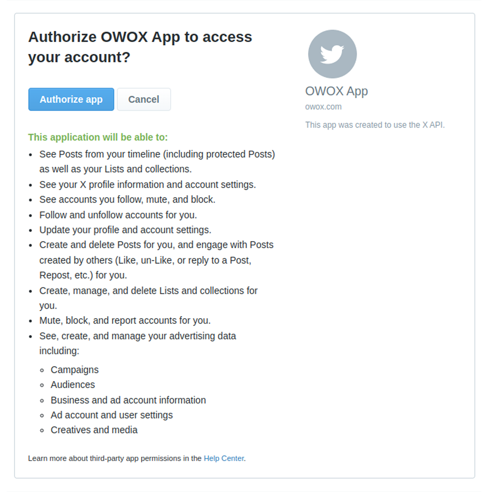

# How to obtain credentials for the X Ads source

To use the X Ads connector, you need to generate the required API credentials by registering and configuring an app in the [X Developer Portal](https://developer.x.com/). Follow the steps below to complete the setup.

## Step 1: Create and Configure Your Developer App

Visit the [X Developer Portal](https://developer.x.com/) and sign in with your account. Press 'Start Building' button.

After signing up, you will be prompted create a project.
Fill the name of the project (for example, OWOX Project) and choose 'Exploring the API' use case.
Description is optional.

Click Create button.

Ensure that you selected Free tier and create the new app. After creating, you'll see the API keys. Copy them and store them securely. If you didn't cope them, no worries, you can regenerate them later from Keys & Tokens page.

To begin using the X Ads API, you need to request access. Follow the steps below to complete the process.

## Step 2: Request Ads API Access

Fill out the official [X Ads API Access Request Form](https://docs.x.com/forms/ads-api-access).

You’ll need to provide your **X Developer App ID**, which can be found on your app's detail page:  

Describe how you intend to use the API.  

Here’s an example:

> _"We are advertisers looking to connect with the X Ads API to access campaign data for analysis and optimization. The data will be pulled via the OWOX Data Marts platform and used to support strategic decision-making across our marketing efforts."_

After submitting the form, wait for confirmation. Once your request is approved, you will receive an email notification.
Once approved, you'll be ready to proceed with connecting your app to the X Ads API.

## Step 3: Generate API Keys

Navigate to the **Keys & Tokens** tab. If you copied Consumer Key and Secret Key from Step 1, go to the [Access Token generation step](#step-4-generate-access-token-and-token-secret).

In the **OAuth 1.0 Keys** section (If you didn't copy Consumer Key and Secret Key from Step 1):

- Click **Regenerate**
- Save your **Consumer Key** and **Secret Key**

## Step 4: Generate Access Token and Token Secret

On the next sections Generate Access Token and Token Secret and save it.

## Step 5: Request a Temporary OAuth Token

Next, make a request using [Postman](https://web.postman.co/).

- **Method:** `POST`  
- **Endpoint:** `https://api.twitter.com/oauth/request_token`  

In the Authorization tab, use the following OAuth 1.0 settings:

- **Signature Method**: HMAC-SHA1  
- **Consumer Key**: your **Consumer Key** from creating your API keys or from [Step 3](#step-3-generate-api-keys)  
- **Consumer Secret**: your **Consumer Secret** from creating your API keys or from [Step 3](#step-3-generate-api-keys)  
- **Access Token**: your **Access Token** from creating your API keys or from [Step 4](#step-4-generate-access-token-and-token-secret)
- **Token Secret**: your **Token Secret** from creating your API keys or from [Step 4](#step-4-generate-access-token-and-token-secret)

Click **Send**. The response will look like:

`oauth_token=E4MQKQAAAAAB1yCFAAABl2OHH80&oauth_token_secret=UlDQaqOoJHj1VvLQ8fQH6Iq686rEFww2&oauth_callback_confirmed=true`

## Step 6: Authorize the App

Copy the `oauth_token` value (`E4MQKQAAAAAB1yCFAAABl2OHH80` in the example above) and insert it into the following URL:

`https://api.twitter.com/oauth/authorize?oauth_token=YOUR_OAUTH_TOKEN`

For example, with `oauth_token=E4MQKQAAAAAB1yCFAAABl2OHH80`, the URL would be:

`https://api.twitter.com/oauth/authorize?oauth_token=E4MQKQAAAAAB1yCFAAABl2OHH80`

Open the URL in your browser and click **Authorize App**.  

   

You will see the pin. Copy it and back to the Postman.

## Step 7: Exchange for Permanent Tokens

Make request using Postman.

- **Endpoint:** `https://api.twitter.com/oauth/access_token`  
- **Method:** `POST`  

In the Authorization tab, use the following OAuth 1.0 settings:

- **Consumer Key**: your **API Key**
- **Consumer Secret**: your **API Secret**
- **Access Token**: the `oauth_token` from Step 6
- **Access Token Secret**: the `oauth_token_secret` from Step 5
- **Verifier**: the `PIN` from the previous step

Click **Send**. The response will include your permanent tokens:

`oauth_token=1534231826281152515-kDGnM70as1fh6xoYWK9HvlwtDHHqe8&oauth_token_secret=KiXVKSyHifVoVm7vq3iC7zjclE1ocqvgpouS95RuLXM61&user_id=1534231826281152213&screen_name=examplename`

Save the oauth_token and oauth_token_secret to use it to set the credentials in your connector configuration.

## ✅ Final Credentials

You now have all the credentials required to use the X Ads connector:

- **Consumer Key (API Key)** – from your X Ads App (Step 4)
- **Consumer Secret (API Secret)** – from your X Ads App (Step 4)
- **Access Token (oauth_token)** – from Step 7
- **Access Token Secret (oauth_token_secret)** – from Step 7

Refer to the [Getting Started Guide](GETTING_STARTED.md) to complete the setup.

## Troubleshooting and Support

If you encounter any issues:

1. Browse the [Q&A section](https://github.com/OWOX/owox-data-marts/discussions/categories/q-a) — your question might already be answered.
2. To report a bug or technical issue, [open a GitHub issue](https://github.com/OWOX/owox-data-marts/issues).
3. Join the [discussion forum](https://github.com/OWOX/owox-data-marts/discussions) to ask questions, share feedback, or suggest improvements.
